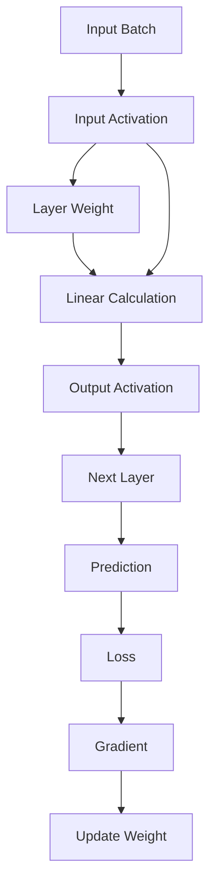

# Hardware and Computer Architecture

AI 서비스의 하드웨어, 웹 통신, 데이터·모델 생애주기와 운영 인프라를 연결해 이해합니다.

***

## 01. Computer Architecture

### Learning Goal

컴퓨터를 부품 목록이 아니라 **명령과 데이터가 이동하는 시스템**으로 이해한다. AI 서비스의 성능도 단일 장치의 최고 속도가 아니라 전체 경로의 균형에 의해 결정된다는 관점을 만든다.

### 1. 컴퓨터의 기본 구성

| 구성 요소   | 역할                     | 쉬운 비유                |
| :------ | :--------------------- | :------------------- |
| CPU     | 명령어 해석, 제어, 범용 연산      | 작업을 지휘하고 수행하는 사람     |
| RAM     | 실행 중인 프로그램과 데이터의 임시 보관 | 현재 사용하는 책상           |
| SSD/HDD | 파일과 프로그램의 장기 보관        | 책장                   |
| GPU     | 같은 형태의 계산을 대량 병렬 처리    | 계산을 나누어 수행하는 대규모 작업대 |
| 메인보드    | 장치의 물리적 연결과 통신 경로 제공   | 건물과 도로망              |
| 네트워크 장치 | 다른 컴퓨터와 데이터 송수신        | 외부로 이어지는 출입구         |

프로그램 파일은 저장장치에 존재하지만 그대로 실행되는 것은 아니다. 운영체제가 필요한 코드와 데이터를 RAM에 올리고, CPU가 명령을 실행한다. GPU 연산이 필요하면 데이터가 다시 GPU의 VRAM으로 복사된다.

```text
Storage -> RAM -> CPU control -> VRAM -> GPU compute
                    |                       |
                    +---- result <----------+
                              |
                    RAM -> Storage / Network
```

### 2. 명령어와 데이터

CPU는 메모리에서 명령어를 가져오고(fetch), 해석하고(decode), 실행한다(execute). 이 과정은 매우 빠르게 반복된다. CPU가 계산할 데이터도 메모리에서 가져와야 하므로 연산 장치와 메모리 사이의 거리와 속도가 중요하다.

CPU가 아무리 빨라도 다음 데이터가 도착하지 않으면 기다린다. 이 차이를 줄이기 위해 CPU 내부에는 작고 빠른 캐시가 있다.

| 계층          | 일반적 특성                |
| :---------- | :-------------------- |
| 레지스터        | CPU 내부, 가장 작고 빠름      |
| L1/L2/L3 캐시 | 작고 빠르며 CPU 가까이에 위치    |
| RAM         | 더 크지만 캐시보다 느림         |
| SSD/HDD     | 훨씬 크고 영구적이지만 RAM보다 느림 |

이를 **메모리 계층 구조**라고 한다. 위로 갈수록 빠르고 작으며 비싸고, 아래로 갈수록 느리지만 크고 저렴하다.

### 3. 메인보드, 버스, PCIe

메인보드는 부품을 꽂는 판을 넘어 부품 간 통신 경로를 제공한다. 버스는 데이터, 주소, 제어 신호가 이동하는 통로를 뜻한다.

GPU와 NVMe SSD는 주로 PCI Express(PCIe)를 통해 연결된다. PCIe의 `x4`, `x8`, `x16`은 사용할 수 있는 레인 수를 나타낸다. 세대와 레인 수가 함께 전송 대역폭을 결정한다. 빠른 GPU를 장착해도 연결 대역폭이나 CPU가 데이터를 충분히 공급하지 못하면 기대 성능이 나오지 않는다.

### 4. 병목은 가장 느린 구간에서 생긴다

AI 데이터 처리 경로를 수도관으로 보면 전체 유량은 가장 좁은 구간에 제한된다.

* 저장장치가 느리면 학습 데이터를 RAM으로 공급하지 못한다.
* RAM이 부족하면 스왑이 발생하거나 프로세스가 종료될 수 있다.
* CPU 전처리가 느리면 GPU가 데이터를 기다린다.
* PCIe 또는 네트워크 대역폭이 부족하면 장치 간 복사가 지연된다.
* GPU가 포화되면 요청이 대기열에 쌓인다.

따라서 “GPU 사용률이 낮다”는 사실만으로 GPU가 불필요하다고 결론 내릴 수 없다. GPU가 CPU, 디스크, 네트워크를 기다리는 상황일 수 있다.

### 5. AI 서비스에서의 적용

사용자가 파일을 첨부해 AI 분석을 요청한다고 가정해 보자.

1. 파일이 네트워크를 통해 서버 저장소로 들어온다.
2. CPU가 파일 형식을 확인하고 전처리한다.
3. 데이터가 RAM에 적재된다.
4. 입력 텐서가 VRAM으로 복사된다.
5. GPU가 추론을 수행한다.
6. 결과가 RAM으로 돌아와 JSON으로 변환된다.
7. 응답은 네트워크로 전송되고 로그는 저장장치에 기록된다.

모델 추론은 5번에서 일어나지만, 사용자가 체감하는 시간은 1번부터 7번까지의 합이다.

### Technical Literacy Check

* RAM과 저장장치의 역할을 구분할 수 있는가?
* CPU 캐시가 필요한 이유를 설명할 수 있는가?
* PCIe 레인과 대역폭이 장치 성능에 미치는 영향을 설명할 수 있는가?
* 단일 부품이 아니라 데이터 이동 경로에서 병목을 찾을 수 있는가?

### What I learned

컴퓨터 성능은 가장 비싼 부품 하나로 결정되지 않는다. 저장장치에서 메모리와 연산 장치를 거쳐 네트워크로 나가는 전체 경로 중 가장 느린 구간이 처리 속도를 제한한다.

### Questions I can now ask

* 데이터가 저장장치에서 RAM으로 충분히 빠르게 공급되는가?
* CPU 전처리가 GPU를 기다리게 하고 있지는 않은가?
* GPU 또는 NVMe SSD가 충분한 PCIe 대역폭을 확보했는가?
* 현재 문제는 연산 부족인가, 데이터 이동 병목인가?

***

## 02. CPU, GPU, Memory, Storage

### Learning Goal

CPU·GPU·RAM·VRAM·저장장치의 역할을 구분하고, “용량이 크다”와 “처리가 빠르다”를 혼동하지 않는다.

### 1. CPU와 GPU

| 항목        | CPU                    | GPU                  |
| :-------- | :--------------------- | :------------------- |
| 설계 목적     | 범용 처리와 복잡한 제어          | 같은 형태의 계산을 대량 병렬 처리  |
| 코어 특성     | 비교적 적고 강력한 코어          | 매우 많은 단순 연산 코어       |
| 강점        | 조건 분기, OS, API 처리, 전처리 | 행렬·벡터 연산, 그래픽, 모델 계산 |
| AI 서비스 역할 | 요청 제어, 데이터 준비, 직렬화     | 학습과 추론의 대규모 계산       |

CPU는 순차적 판단과 다양한 작업을 유연하게 처리한다. GPU는 같은 연산을 수많은 데이터에 반복하는 데 강하다. 둘은 경쟁 관계가 아니라 협업 관계다. CPU가 데이터를 준비하지 못하면 GPU는 놀고, GPU가 포화되면 CPU가 준비한 작업은 대기한다.

딥러닝은 큰 숫자 표인 행렬과 tensor의 곱셈·덧셈을 반복한다. 이미지 인식, 음성 인식, 추천, LLM은 모델 구조는 달라도 대량의 유사 계산을 수행한다는 공통점이 있어 GPU 병렬 구조와 잘 맞는다.

#### 코어, 스레드, 클럭, 캐시

* **코어**: 독립적으로 명령을 실행하는 물리 연산 단위
* **스레드**: 프로그램의 실행 흐름. 하드웨어 스레드는 코어 자원을 효율적으로 공유한다.
* **클럭**: 동작 주기의 빈도. 높은 GHz가 모든 작업에서 높은 성능을 보장하지는 않는다.
* **캐시**: 자주 쓰는 코드와 데이터를 CPU 가까이에 보관하는 고속 메모리

성능은 코어 수나 클럭 하나로 비교할 수 없다. 작업의 병렬화 가능성, 아키텍처, 메모리 접근, 전력·발열 제한이 함께 작용한다.

### 2. RAM과 VRAM

RAM은 시스템 전체가 사용하는 작업 공간이고, VRAM은 GPU가 직접 사용하는 작업 공간이다.

| 구분    | RAM                    | VRAM                 |
| :---- | :--------------------- | :------------------- |
| 소유 주체 | CPU 중심의 시스템 메모리        | GPU 전용 메모리           |
| 주요 내용 | 실행 코드, 파일 버퍼, 프로세스 데이터 | 모델 가중치, 입력, 중간 계산 결과 |
| 부족할 때 | 스왑, 심한 지연, 프로세스 종료     | 배치 축소, 오프로딩, OOM 오류  |

VRAM에 들어가야 하는 것은 모델 파라미터뿐이 아니다. 입력 데이터, 활성값, 임시 작업 공간도 필요하다. 그래서 “모델 파일 크기보다 VRAM이 크다”는 사실만으로 실행 가능성을 확정할 수 없다.

VRAM 부족 시 나타날 수 있는 결과는 다음과 같다.

* 모델 자체를 장치에 올리지 못한다.
* batch size를 줄여야 한다.
* activation과 임시 tensor를 저장하지 못한다.
* CPU RAM과 VRAM 사이의 offloading이 늘어 속도가 떨어진다.
* 런타임이 Out of Memory 오류로 작업을 중단한다.

GPU 사양은 연산량뿐 아니라 VRAM 용량과 메모리 대역폭을 함께 봐야 한다.

### 3. Tensor Core와 숫자 정밀도

현대 AI 가속기에는 행렬 연산에 특화된 Tensor Core 계열 장치가 포함될 수 있다. 이 장치는 더 낮은 정밀도의 숫자 표현을 활용해 처리량을 높이고 메모리 사용량을 줄인다.

| 정밀도       | 특징                         | 대표 용도           |
| :-------- | :------------------------- | :-------------- |
| FP32      | 표현 범위와 정밀도가 높지만 메모리 사용이 큼  | 기준 학습·일부 민감 연산  |
| FP16      | 빠르고 작지만 표현 범위가 좁음          | 혼합 정밀도 학습       |
| BF16      | FP32와 비슷한 지수 범위, 낮은 유효 정밀도 | 대규모 모델 학습       |
| TF32      | 일부 GPU의 FP32 행렬 연산 가속 형식   | 학습 가속           |
| INT8/INT4 | 정수 기반 저비트 표현               | 추론 quantization |

**혼합 정밀도 학습**은 모든 계산을 무조건 낮은 정밀도로 바꾸는 것이 아니다. 민감한 계산은 높은 정밀도로 유지하고, 안전한 행렬 연산은 낮은 정밀도로 수행한다. 품질·overflow·underflow를 검증해야 한다.

**Quantization**은 학습된 모델의 weight와 activation을 더 적은 bit로 표현해 메모리와 추론 비용을 줄인다. 속도 향상 정도와 품질 손실은 하드웨어·연산자 지원·데이터에 따라 달라진다.

### 4. 스왑과 OOM

RAM이 부족하면 운영체제는 일부 메모리 내용을 저장장치의 스왑 영역으로 옮길 수 있다. 이는 작업을 계속하게 해주지만 저장장치는 RAM보다 훨씬 느리므로 성능이 급격히 저하될 수 있다.

메모리 확보에 실패하면 운영체제나 런타임이 프로세스를 종료한다. GPU에서도 메모리 할당에 실패하면 `Out of Memory` 오류가 발생한다. 이 경우 선택지는 모델 축소, 배치 크기 축소, 정밀도 조정, 여러 장치 분산, 불필요한 메모리 해제 등이다.

### 5. 저장장치와 I/O

| 항목        | HDD      | SATA SSD | NVMe SSD        |
| :-------- | :------- | :------- | :-------------- |
| 구조        | 회전 디스크   | 플래시 메모리  | 플래시 + PCIe/NVMe |
| 지연 시간     | 높음       | 낮음       | 더 낮음            |
| 무작위 접근    | 약함       | 강함       | 매우 강함           |
| 대량 AI 데이터 | 병목 가능성 큼 | 일반적 활용   | 고성능 작업에 적합      |

AI 작업은 작은 파일을 많이 읽거나 큰 체크포인트를 반복 저장할 수 있다. 따라서 순차 읽기 속도뿐 아니라 무작위 I/O, IOPS, 파일 수, 동시 접근 패턴도 중요하다.

### 6. 대역폭과 지연 시간

* **대역폭**은 단위 시간에 옮길 수 있는 데이터 양이다.
* **지연 시간**은 요청을 보내고 첫 결과를 얻기까지 걸리는 시간이다.

큰 모델 파일 복사에는 대역폭이 중요하고, 작은 파일을 수없이 여는 작업에는 지연 시간과 IOPS가 더 큰 영향을 줄 수 있다. 장치 사양은 실제 작업 패턴과 함께 봐야 한다.

### 7. 자원 상태로 문제 읽기

| 관찰                 | 가능한 해석                     |
| :----------------- | :------------------------- |
| GPU 30%, CPU 100%  | 전처리 또는 요청 처리가 CPU 병목일 수 있음 |
| GPU 100%, 요청 대기 증가 | 추론 용량 부족 또는 배치 전략 문제 가능    |
| RAM 지속 증가          | 캐시 증가, 메모리 누수, 해제 지연 가능    |
| VRAM 한계 도달         | 모델·입력·배치가 장치 용량을 초과할 위험    |
| 디스크 사용률 높고 GPU 낮음  | 데이터 로딩 또는 체크포인트 I/O 병목 가능  |

하나의 메트릭만으로 원인을 확정해서는 안 된다. 시간대가 같은 CPU, GPU, 메모리, I/O, 요청량, 지연 시간 지표를 함께 비교해야 한다.

### Technical Literacy Check

* CPU와 GPU의 강점이 다른 이유를 설명할 수 있는가?
* RAM과 VRAM의 부족 증상을 구분할 수 있는가?
* 용량, 대역폭, 지연 시간, IOPS를 구분할 수 있는가?
* 낮은 GPU 사용률을 다른 자원 지표와 함께 해석할 수 있는가?
* FP32, FP16/BF16, INT8/INT4가 성능·메모리·품질의 trade-off임을 설명할 수 있는가?

### What I learned

AI 성능은 GPU 계산 능력뿐 아니라 CPU의 데이터 준비, RAM과 VRAM의 용량, 저장장치의 I/O, 장치 사이 전송 속도에 의해 결정된다. 자원은 각자 다른 역할을 하므로 동일한 “메모리”나 “속도”로 뭉뚱그려 볼 수 없다.

### Questions I can now ask

* 모델과 중간 계산 결과가 VRAM에 들어가는가?
* GPU가 낮은 사용률을 보이는 동안 CPU나 디스크가 포화되는가?
* 이 워크로드는 순차 전송 속도와 무작위 I/O 중 무엇에 민감한가?
* 스왑이 발생하고 있거나 OOM으로 종료된 기록이 있는가?
* 어떤 precision과 quantization을 사용하며 품질 저하를 어떻게 검증했는가?

***

## 03. Weight, Activation, and Batch

* Weight = 학습된 모델 안에 저장된 고정된 숫자
* Activation = 입력 데이터가 모델을 통과하면서 매번 새로 계산되는 중간 결과
* Batch = 여러 입력 데이터를 한 번에 묶어서 처리하는 단위

***

### 1. Weight란 무엇인가?

Weight는 모델이 학습을 통해 얻은 숫자입니다.

예를 들어 아주 단순한 모델이 있다고 해보겠습니다.

```
y = wx + b
```

여기서:

| 기호 | 의미     |
| :- | :----- |
| x  | 입력값    |
| w  | weight |
| b  | bias   |
| y  | 출력값    |

w와 b는 모델이 학습하면서 조정한 값입니다.

예를 들어 질병 위험도를 예측하는 모델이 있다고 하면:

```
위험 점수 = 0.8 × 나이 + 1.5 × 혈당 - 2.0
```

여기서:

```
0.8 = 나이에 대한 weight
1.5 = 혈당에 대한 weight
-2.0 = bias
```

입니다.

즉, weight는 모델이 “이 입력을 얼마나 중요하게 볼 것인가”를 나타내는 숫자입니다.

***

### 2. 학습된 모델의 weight는 저장된다

모델 학습이 끝나면 weight는 파일로 저장됩니다.

예를 들어:

```
model.pt
model.safetensors
model.bin
checkpoint.pth
```

같은 파일 안에는 모델 구조 자체보다도, *학습된 weight*들이 많이 들어 있습니다.

모델을 불러온다는 것 "모델 구조를 만들고 그 안에 학습된 weight 값을 채워 넣는다”는 의미입니다.
즉, 학습된 모델은 “학습된 weight 집합”이라고 봐도 됩니다.

***

### 3. Activation이란 무엇인가?

Activation은 입력 데이터가 모델을 통과하면서 각 layer에서 계산되는 중간 결과입니다.

예를 들어 모델이 다음 구조라고 해봅시다.

```
입력 → Layer 1 → Layer 2 → Layer 3 → 출력
```

입력 데이터가 Layer 1을 통과하면 어떤 숫자 묶음이 나옵니다.
이 결과가 Layer 1의 activation입니다.

그 activation이 다시 Layer 2의 입력이 됩니다.
Layer 2를 통과한 결과는 Layer 2의 activation입니다.

즉:

```
Activation = 각 layer가 입력을 받아 계산한 출력값
```

입니다.

***

### 4. Weight와 activation의 차이

둘은 모두 숫자이지만 성격이 완전히 다릅니다.

| 구분         | Weight            | Activation                |
| :--------- | :---------------- | :------------------------ |
| 의미         | 모델이 학습한 파라미터      | 입력이 지나가며 생기는 중간 계산값       |
| 언제 생김      | 학습 과정에서 만들어지고 저장됨 | 추론/학습 시 매 입력마다 계산됨        |
| 입력에 따라 변함? | 일반적으로 고정          | 입력 데이터마다 달라짐              |
| 저장 여부      | 모델 파일에 저장         | 보통 일시적으로 메모리에 존재          |
| 비유         | 요리사의 레시피          | 실제 요리 중간 결과물              |
| 예시         | weight matrix     | hidden state, feature map |

중요한 차이는 이것입니다.

Weight는 모델 안에 저장된 값이고,
Activation은 데이터가 모델을 통과할 때 생기는 값입니다.

***

### 5. Batch란 무엇인가?

Batch는 여러 개의 입력 데이터를 한 번에 묶어서 처리하는 단위입니다.

예를 들어 이미지를 하나씩 처리할 수도 있습니다.

```
이미지 1개 → 모델 → 결과 1개
```

하지만 실제 AI 학습이나 추론에서는 보통 여러 개를 묶어서 처리합니다.

```
이미지 32개 → 모델 → 결과 32개
```

이때 32개가 batch size입니다.

batch size = 한 번에 모델에 넣는 데이터 개수

***

### 6. 왜 batch를 쓰는가?

batch를 쓰는 이유는 GPU가 여러 데이터를 한꺼번에 계산하는 데 강하기 때문입니다.

GPU는 단순 계산을 병렬로 많이 처리하는 장치입니다.
데이터를 하나씩 넣는 것보다 여러 개를 묶어서 넣으면 GPU 자원을 더 효율적으로 사용할 수 있습니다.

비유하면:

한 명씩 계산시키기 = 계산대 하나에 손님 한 명씩 보내기
batch 처리 = 손님 여러 명의 주문을 한 번에 처리하기

입니다.

***

### 7. Batch와 activation의 관계

batch가 커지면 activation도 그만큼 커집니다.

예를 들어 한 이미지가 layer를 통과했을 때 activation 크기가 다음과 같다고 해봅시다.

```
[768]
```

즉, 숫자 768개짜리 벡터입니다.

batch size가 1이면 activation shape은:

```
[1, 768]
```

batch size가 32이면 activation shape은:

```
[32, 768]
```

입니다.

즉:

batch size가 커질수록 한 번에 저장해야 하는 activation 양도 커진다.

그래서 batch size를 키우면 GPU를 효율적으로 쓸 수 있지만, VRAM 사용량도 증가합니다.

***

### 8. Weight와 batch의 관계

weight는 batch size가 바뀌어도 보통 그대로입니다.

예를 들어 어떤 layer의 weight shape이 다음과 같다고 해봅시다.

```
Weight shape = [768, 3072]
```

batch size가 1이면 입력 shape은:

```
Input activation = [1, 768]
```

계산 결과는:

```
[1, 768] × [768, 3072] = [1, 3072]
```

batch size가 32이면:

```
Input activation = [32, 768]
```

계산 결과는:

```
[32, 768] × [768, 3072] = [32, 3072]
```

여기서 중요한 점은:

weight \[768, 3072]는 그대로이고,
batch 차원만 1에서 32로 늘어난다.

즉, batch는 “한 번에 몇 개의 입력을 처리할지”를 정하지만, weight 자체를 바꾸지는 않습니다.

***

### 9. 세 개의 관계를 한 번에 보기

한 layer의 계산을 보면 관계가 가장 명확합니다.

* Input Activation × Weight + Bias = Output Activation

예를 들어:

```
[batch_size, input_dim] × [input_dim, output_dim] + [output_dim]
= [batch_size, output_dim]
```

구체적으로:

```
[32, 768] × [768, 3072] + [3072] 
= [32, 3072]
```

여기서:

| 요소           | 의미                          |
| :----------- | :-------------------------- |
| \[32, 768]   | batch 32개에 대한 입력 activation |
| \[768, 3072] | 학습된 weight                  |
| \[3072]      | 학습된 bias                    |
| \[32, 3072]  | 출력 activation               |

즉, 한 layer에서 일어나는 일은 다음과 같습니다.

batch에 포함된 여러 입력의 activation이
같은 weight를 공유해서 통과하고
그 결과 새로운 activation이 만들어진다.

***

### 10. 학습 때와 추론 때의 차이

#### 추론 Inference

추론에서는 weight가 고정되어 있습니다.

```
고정된 weight + 새 입력 데이터 → activation 계산 → 예측 결과
```

예를 들어 학습이 끝난 질병 예측 모델에 새 환자 데이터를 넣으면, 모델은 저장된 weight를 사용해 activation을 계산하고 결과를 냅니다.

이때 weight는 바뀌지 않습니다.

#### 학습 Training

학습에서는 weight가 계속 바뀝니다.

흐름은 다음과 같습니다.

```
입력 batch
→ activation 계산
→ 예측
→ loss 계산
→ gradient 계산
→ weight 업데이트
```

즉, 학습 중에는 activation도 계산되고, 그 activation을 바탕으로 loss와 gradient가 계산되며, 최종적으로 weight가 조금씩 수정됩니다.

***

### 11. 학습 중 activation이 중요한 이유

학습할 때는 activation을 단순히 계산하고 버리는 것이 아닙니다.

역전파, 즉 backpropagation을 위해 중간 activation들을 기억해야 합니다.

왜냐하면 모델이 weight를 어떻게 수정해야 하는지 계산하려면, 각 layer에서 어떤 값이 나왔는지를 알아야 하기 때문입니다.

그래서 학습 중에는 activation 저장량이 VRAM 사용량에 큰 영향을 줍니다.

```
학습 VRAM 사용량 =
weight 저장
activation 저장
gradient 저장
optimizer state 저장

```

반면 추론에서는 보통 gradient와 optimizer state가 필요 없기 때문에 학습보다 VRAM 사용량이 적습니다.

***

### 12. VRAM 관점에서의 관계

GPU 메모리, 즉 VRAM에는 주로 다음이 올라갑니다.

| 항목              | 학습 시  | 추론 시           |
| :-------------- | :---- | :------------- |
| Weight          | 필요    | 필요             |
| Activation      | 많이 필요 | 필요하지만 상대적으로 적음 |
| Gradient        | 필요    | 불필요            |
| Optimizer state | 필요    | 불필요            |
| Input batch     | 필요    | 필요             |

그래서 같은 모델이라도 학습은 추론보다 훨씬 많은 VRAM이 필요합니다.

특히 batch size가 커지면 activation이 커지므로 VRAM 사용량이 증가합니다.

***

### 13. 한눈에 보는 관계



추론에서는 보통 아래까지만 갑니다.

```
Input Batch → Activation 계산 → Prediction
```

학습에서는 여기에 추가로 다음 과정이 붙습니다.

```
Loss 계산 → Gradient 계산 → Weight 업데이트
```

***

### 14. 아주 짧은 비유

#### Weight

모델이 학습해서 갖게 된 레시피

#### Activation

그 레시피를 실제 재료에 적용했을 때 나오는 중간 요리 상태

#### Batch

한 번에 요리하는 주문 묶음

예를 들어 레시피는 동일합니다.
하지만 주문이 김치볶음밥 1개인지, 32개인지에 따라 중간 조리량은 달라집니다.

같은 weight를 사용하지만,
batch가 커지면 activation도 커진다.

***

### 15. 최종 정리

| 개념         | 정의                | 변하는가?            | 어디에 저장되는가?      |
| :--------- | :---------------- | :--------------- | :-------------- |
| Weight     | 학습된 모델 파라미터       | 학습 중 변함, 추론 중 고정 | 모델 파일, GPU VRAM |
| Activation | 각 layer의 중간 계산 결과 | 입력마다 달라짐         | 실행 중 GPU VRAM   |
| Batch      | 한 번에 처리하는 입력 묶음   | 사용자가 설정          | 입력 데이터 형태       |

가장 중요한 관계는 이것입니다.

Activation = Input Batch가 Weight를 통과하며 만들어지는 중간 결과

그리고 한 layer의 핵심 계산은 다음과 같습니다.

Input Activation × Weight + Bias = Output Activation

즉:

Weight는 모델이 배운 지식이고,
Batch는 한 번에 넣는 데이터 묶음이며,
Activation은 그 batch가 weight를 통과하면서 만들어지는 계산 결과입니다.

***

[트랙 목차](./README.md) · [다음: Operating System, Server, and Web Communication](./02-operating-system-server-and-web.md)
