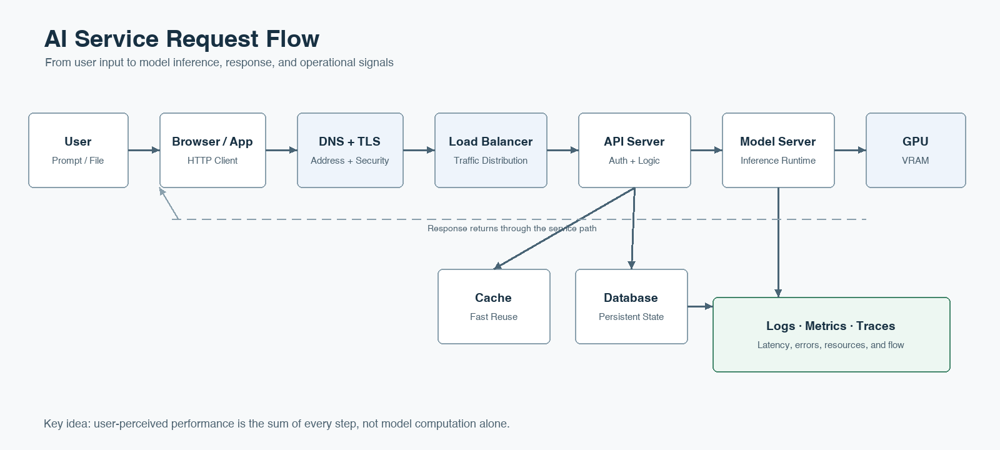

# Computer Systems Literacy

AI 서비스의 하드웨어, 웹 통신, 데이터·모델 생애주기와 운영 인프라를 연결해 이해합니다.

## Contents

1. [Hardware and Computer Architecture](./01-hardware-and-computer-architecture.md)
   - 01. Computer Architecture · 02. CPU, GPU, Memory, Storage
2. [Operating System, Server, and Web Communication](./02-operating-system-server-and-web.md)
   - 03. Operating System and Process · 04. Server and Web Communication · 05. API, HTTP, DNS, TLS
3. [Performance, Data Processing, and Infrastructure](./03-performance-data-processing-and-infrastructure.md)
   - 06. Performance: Latency and Throughput · 07. Cache, Queue, Batch, Stream · 08. Container, Cloud, Observability
4. [AI Data, LLM, and Operations](./04-ai-data-llm-and-operations.md)
   - 09. Data and Model Lifecycle · 10. LLM, RAG, and Vector Database · 11. MLOps, Governance, and Cost

## Reading Guide

각 통합 문서는 서로 연관된 기존 장을 한 학습 단위로 묶었습니다. 문서 내부의 구분선과 장 제목을 이용하면 기존 세부 주제를 그대로 찾아볼 수 있습니다.

[전체 프로젝트로 돌아가기](../../README.md) · [References](../../references/computer-systems.md)
