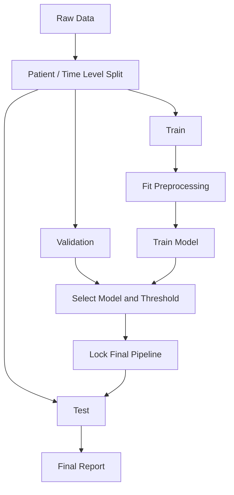

# Data, Probability, and Validation

데이터 분포부터 임상 AI 지표, calibration과 모델 검토까지 하나의 평가 흐름으로 이해합니다.

---

## 01. Data Distribution

### Learning Goal

평균 하나로 데이터를 대표할 때 생기는 한계를 이해하고, 중심·퍼짐·분포 모양·이상치를 함께 읽는다.

### 평균, 중앙값, 대표값

평균은 모든 값을 더해 관측치 수로 나눈 값이다. 전체 정보를 사용하므로 유용하지만 극단값에 민감하다. 중앙값은 정렬했을 때 가운데 값으로, 치우친 분포에서 전형적인 대상을 더 잘 나타낼 수 있다.

환자 5명의 혈당이 `100, 110, 120, 130, 140`이라면 평균은 다음과 같다.

```text
(100 + 110 + 120 + 130 + 140) / 5 = 120
```

평균은 집단의 중심을 한 숫자로 요약하지만 각 환자의 차이와 분포 모양을 보여주지는 않는다.

| 그룹 | 값 | 평균 | 중앙값 |
|---|---|---:|---:|
| A | 118, 119, 120, 121, 122 | 120 | 120 |
| B | 60, 90, 120, 150, 180 | 120 | 120 |

두 그룹은 평균과 중앙값이 같지만 B가 훨씬 넓게 퍼져 있다. 대표값만으로 집단을 이해할 수 없는 이유다.

### 분산과 표준편차

분산은 각 값이 평균에서 떨어진 정도를 제곱해 평균낸 값이다. 표준편차는 분산의 제곱근이라 원래 자료와 같은 단위를 갖는다.

- 표준편차가 작다: 값이 평균 주변에 비교적 모여 있다.
- 표준편차가 크다: 값이 넓게 퍼져 있다.

학생 점수에 비유하면 평균은 반 전체의 대표 점수이고 분산은 학생별 점수가 얼마나 들쭉날쭉한지 나타낸다. 평균이 80점으로 같아도 모두 78~82점인 반과 30~100점에 흩어진 반은 전혀 다른 집단이다.

분산은 평균과의 차이를 제곱하므로 원래 단위가 제곱된다. 혈당 단위가 mg/dL라면 분산의 단위는 그 제곱이 된다. 표준편차는 분산의 제곱근이므로 다시 원래 단위로 돌아와 해석이 쉽다.

표준편차는 모든 분포에서 “대부분이 평균 ± 표준편차 안에 있다”는 뜻은 아니다. 정규분포 가정이 적절한지 확인하지 않고 68-95-99.7 규칙을 적용하면 안 된다.

### 분포의 모양

데이터를 볼 때 다음을 확인한다.

- 대칭인가, 한쪽으로 치우쳤는가?
- 봉우리가 하나인가, 여러 하위집단이 섞였는가?
- 꼬리가 길거나 극단값이 많은가?
- 값의 범위가 임상적으로 가능한가?
- 결측이 특정 집단에 집중되어 있는가?

의료비, 입원 기간, 검사 수치는 오른쪽 꼬리가 길 수 있다. 이 경우 평균과 표준편차만 보고하기보다 중앙값과 사분위 범위를 함께 보는 것이 낫다.

### 이상치와 결측치

이상치는 측정 오류일 수도 있고 실제로 중요한 희귀 사례일 수도 있다. 자동 삭제하기 전에 원인을 조사해야 한다. 결측도 무작위가 아닐 수 있다. 예를 들어 중증 환자에게만 특정 검사를 시행했다면 “검사값이 없음” 자체가 환자 상태와 관련된다.

### 모델 평가에서의 변동성

교차검증 결과가 `0.91, 0.90, 0.92, 0.89, 0.91`이라면 평균과 fold 간 변동이 모두 안정적이다. `0.99, 0.72, 0.95, 0.68, 0.97`은 비슷한 평균을 만들 수 있어도 분할에 매우 민감하다.

| Fold | 안정적인 모델 AUROC | 불안정한 모델 AUROC |
|---:|---:|---:|
| 1 | 0.91 | 0.99 |
| 2 | 0.90 | 0.72 |
| 3 | 0.92 | 0.95 |
| 4 | 0.89 | 0.68 |
| 5 | 0.91 | 0.97 |

두 번째 모델은 특정 분할에서는 매우 좋지만 다른 분할에서는 크게 무너진다. 평균만 보고 선택하면 실제 현장에서의 불안정성을 놓칠 수 있다.

성능을 보고할 때는 다음을 함께 본다.

- 반복 또는 fold별 점수와 평균
- 표준편차 또는 신뢰구간
- 표본 수와 양성 사건 수
- 하위집단별 분포와 성능

### Technical Literacy Check

- 평균과 중앙값 중 어느 것이 적절한지 분포를 보고 판단할 수 있는가?
- 표준편차가 데이터의 단위와 같은 이유를 설명할 수 있는가?
- 이상치와 결측치를 무조건 제거하면 안 되는 이유를 말할 수 있는가?

### What I learned

데이터를 이해한다는 것은 대표값 하나를 계산하는 일이 아니다. 중심, 퍼짐, 비대칭, 이상치, 결측과 하위집단을 함께 봐야 모델 성능 숫자의 안정성을 판단할 수 있다.

### Questions I can now ask

- 평균이 극단값이나 치우친 분포에 의해 왜곡되지 않았는가?
- train과 운영 데이터의 분포가 같은가?
- 성능 평균과 함께 변동성 및 신뢰구간을 보고했는가?
- 이상치와 결측은 어떤 규칙으로 처리했는가?

---

## 02. Probability and Conditional Probability

### Learning Goal

모델 점수와 현실의 확률을 구분하고, 조건부확률과 기본률이 진단 결과 해석에 미치는 영향을 이해한다.

### 확률과 모델 출력

확률은 사건의 불확실성을 0과 1 사이로 표현한다. 분류 모델은 종종 `0.82` 같은 점수를 출력하지만, 그 값이 실제 82% 위험을 의미하려면 별도의 보정 검증이 필요하다.

모델이 0.8을 예측한 대상 100명 중 실제 사건이 약 80명에게 발생하는가? 이 질문이 calibration의 출발점이다.

| 확률 | 기본 해석 |
|---:|---|
| 0 | 사건이 발생하지 않음 |
| 0.5 | 두 결과가 비슷하게 불확실함 |
| 1 | 사건이 반드시 발생함 |

실제 모델에서는 0이나 1을 완전한 확정으로 받아들이기보다 데이터와 calibration, 적용 범위를 함께 확인한다.

### 확률과 클래스는 다르다

```text
Predicted probability: 0.73
Threshold:             0.50 -> Positive
Threshold:             0.80 -> Negative
```

예측 확률이 `0.73`일 때도 threshold가 `0.50`이면 양성, `0.80`이면 음성이다. 모델 출력은 같지만 의사결정은 달라진다.

의료 AI에서 threshold는 기술팀만의 선택이 아니다.

- 질병을 놓치는 위해가 큰 선별검사: threshold를 낮춰 sensitivity를 높일 수 있음
- 불필요한 검사·치료 부담이 큰 경우: threshold를 높여 specificity 또는 PPV를 높일 수 있음
- 후속 검토 인력이 제한된 경우: 하루 알림량과 처리 능력도 고려

같은 모델 점수도 임계값에 따라 분류가 달라진다. 임계값을 낮추면 더 많은 양성을 찾지만 거짓 양성도 늘고, 높이면 알림은 줄지만 실제 양성을 놓칠 수 있다. 임계값은 모델의 고정 속성이 아니라 오류 비용과 업무 용량을 반영한 의사결정이다.

### 조건부확률

`P(A|B)`는 B가 주어졌을 때 A일 확률이다. 다음 두 질문은 방향이 다르다.

- 실제 질병이 있을 때 검사 양성일 확률: `P(Test+ | Disease+)` = 민감도
- 검사 양성일 때 실제 질병일 확률: `P(Disease+ | Test+)` = PPV

조건을 뒤집어도 같은 값이 된다고 생각하는 오류가 흔하다.

| 기준이 되는 조건 | 질문 | 지표 |
|---|---|---|
| 실제 질병 있음 | 검사도 양성인가? | Sensitivity |
| 실제 질병 없음 | 검사도 음성인가? | Specificity |
| 검사 양성 | 실제 질병이 있는가? | PPV |
| 검사 음성 | 실제 질병이 없는가? | NPV |

### 사전확률과 사후확률

- **사전확률**: 검사 전 질병 가능성, 임상 환경에서는 유병률이나 환자 특성에 영향받음
- **새 증거**: 검사 또는 모델 결과
- **사후확률**: 결과를 본 뒤 갱신된 질병 가능성

베이즈 정리는 새 증거가 사전확률을 어떻게 바꾸는지 설명한다. 같은 검사라도 중환자실과 일반 건강검진센터에서 양성 결과의 의미가 달라질 수 있다.

### 기본률 문제 예시

10,000명 중 유병률 1%, 민감도 90%, 특이도 95%인 검사를 생각해 보자.

| 결과 | 대략적인 수 |
|---|---:|
| 실제 환자 | 100 |
| 진짜 양성 | 90 |
| 실제 비환자 | 9,900 |
| 거짓 양성 | 495 |

양성 585명 중 실제 환자는 90명으로 PPV는 약 15%다. 민감도와 특이도가 높아 보여도 희귀 질환에서는 거짓 양성이 실제 양성보다 많을 수 있다.

### Technical Literacy Check

- 모델 점수와 잘 보정된 실제 확률을 구분할 수 있는가?
- `P(Test+|Disease+)`와 `P(Disease+|Test+)`를 구분할 수 있는가?
- 같은 모델의 PPV가 환경에 따라 달라지는 이유를 설명할 수 있는가?

### What I learned

확률은 숫자 하나가 아니라 조건을 포함한 표현이다. 모델의 점수를 임계값으로 분류하는 과정과, 기본률을 반영해 결과를 해석하는 과정은 서로 다른 문제다.

### Questions I can now ask

- 모델 출력은 실제 확률로 검증된 값인가, 순위 점수인가?
- 임계값은 어떤 오류 비용과 업무 용량을 기준으로 정했는가?
- 대상 집단의 유병률이 개발 데이터와 같은가?
- 결과를 해석할 때 사전확률을 어떻게 반영하는가?

---

## 03. Train/Test Split and Data Leakage

### Learning Goal

독립적인 평가 데이터가 필요한 이유를 이해하고, 의료 데이터에서 성능을 부풀리는 누수 유형을 식별한다.

### 데이터 분할의 역할

| 데이터 | 역할 | 사용 시점 |
|---|---|---|
| Train | 모델 파라미터 학습 | 반복 사용 |
| Validation | 모델·하이퍼파라미터·임계값 선택 | 개발 과정 |
| Test | 잠긴 최종 모델의 성능 평가 | 마지막 단계 |

test set을 반복해서 확인하며 모델을 수정하면 test 정보가 개발 결정에 반영된다. 이름은 test여도 사실상 validation set이 된 것이다.

### 권장 흐름



### Data Leakage

누수는 실제 예측 시점에는 알 수 없는 정보나 평가 데이터의 정보가 학습에 들어가는 현상이다.

병원 사망 예측 모델의 입력에 퇴원요약서가 포함된 경우를 생각해 보자. 퇴원요약서는 사망 여부나 최종 경과를 알고 난 뒤 작성되었을 수 있다. 배포 시점에 아직 존재하지 않는 문서라면 모델은 미래를 예측한 것이 아니라 미래 정보를 몰래 본 것이다.

| 누수 유형 | 예시 | 방지 방법 |
|---|---|---|
| 시간 누수 | 예측 이후 작성된 퇴원 요약서 사용 | 예측 기준 시점 명시 |
| 환자 누수 | 같은 환자의 방문이 train/test에 분산 | 환자 단위 그룹 분할 |
| 전처리 누수 | 전체 데이터로 평균·스케일 계산 | train에서만 fit |
| 라벨 누수 | 결과를 거의 직접 나타내는 사후 코드 | 임상 시점별 feature 검토 |
| 중복 누수 | 복제·유사 이미지가 양쪽에 존재 | 중복 탐지 후 그룹 분할 |
| 기관 누수 | 병원별 촬영 표식이 라벨과 결합 | 외부 기관 검증, 표식 제거 |

### Cross-validation

교차검증은 제한된 학습 데이터에서 여러 분할로 성능 변동을 평가하는 방법이다. 그러나 분할 단위가 잘못되면 반복 횟수가 많아도 누수를 막지 못한다. 의료 데이터에서는 환자·기관·시간을 고려한 Group K-fold 또는 시간 기반 검증이 필요할 수 있다.

최종 test set은 교차검증 및 튜닝과 분리한다. 전처리, feature selection, 결측치 대체까지 하나의 파이프라인 안에서 각 fold의 train 부분에만 fit해야 한다.

#### 전처리 누수 예시

전체 데이터의 평균과 표준편차로 scaling한 뒤 train/test를 나누면 test 분포 정보가 train 변환에 들어간다. 결측치 대체값, feature selection 기준, oversampling도 같은 원칙을 적용한다.

```text
Wrong: raw data -> fit preprocessing on all data -> split
Right: raw data -> split -> fit preprocessing on train -> transform validation/test
```

### 내부, 시간적, 외부 검증

- **내부 검증**: 같은 출처 데이터의 분할 또는 교차검증
- **시간적 검증**: 이후 기간의 환자에 적용
- **외부 검증**: 다른 기관·지역·장비·업무 흐름에 적용

내부 성능이 좋아도 외부 환경에서 분포와 관행이 달라지면 성능이 떨어질 수 있다.

### Technical Literacy Check

- validation과 test의 역할을 구분할 수 있는가?
- 전처리를 분할 전에 수행하면 왜 누수인지 설명할 수 있는가?
- 환자·시간·기관 단위 분할이 필요한 사례를 말할 수 있는가?

### What I learned

평가의 신뢰성은 모델 종류보다 데이터 분할에서 먼저 결정된다. 독립 test set, 예측 기준 시점, 환자 단위 분할과 train-only 전처리가 지켜지지 않으면 높은 점수도 믿기 어렵다.

### Questions I can now ask

- 같은 환자나 중복 샘플이 train과 test에 함께 있는가?
- feature는 실제 예측 시점에 이용 가능한가?
- 전처리와 feature selection은 train 데이터에서만 학습했는가?
- 외부 기관이나 이후 시점 데이터로 검증했는가?

---

[트랙 목차](./README.md) · [다음: Classification Metrics](./02-classification-metrics.md)
