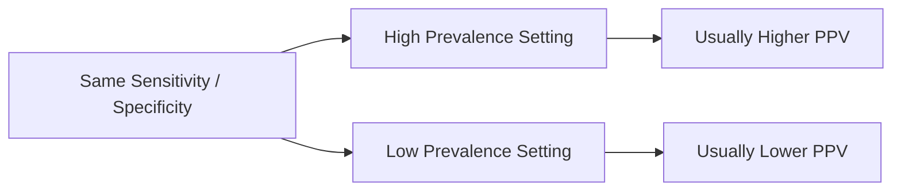

# Classification Metrics

데이터 분포부터 임상 AI 지표, calibration과 모델 검토까지 하나의 평가 흐름으로 이해합니다.

---

## 04. Confusion Matrix

### Learning Goal

정확도 뒤에 숨은 오류 방향을 TP, TN, FP, FN으로 분해하고, 각 오류의 임상·운영 비용을 설명한다.

### 기본 구조

|  | 실제 음성 | 실제 양성 |
|---|---:|---:|
| **예측 음성** | TN | FN |
| **예측 양성** | FP | TP |

| 항목 | 의미 | 의료 예시 |
|---|---|---|
| TP | 실제 양성을 양성으로 예측 | 암 환자를 암으로 탐지 |
| TN | 실제 음성을 음성으로 예측 | 비환자를 정상으로 판단 |
| FP | 실제 음성을 양성으로 오판 | 불필요한 추가 검사 발생 |
| FN | 실제 양성을 음성으로 오판 | 질병을 놓쳐 치료가 지연 |

혼동 행렬을 읽을 때는 예측 축과 실제 축의 방향을 먼저 확인한다. 도구마다 표의 행·열 배치가 반대일 수 있으므로 TP 위치만 외우면 오류가 생긴다.

### 정확도의 함정

정확도는 `(TP + TN) / 전체`다. 유병률이 1%인 10,000명에게 모두 음성이라고 하면 정확도는 99%지만 환자를 한 명도 찾지 못한다. 클래스 불균형 문제에서는 정확도만으로 성능을 판단할 수 없다.

```text
Actual positives: 100
Actual negatives: 9,900
Predict everyone negative -> TN 9,900, FN 100
Accuracy = 9,900 / 10,000 = 99%
Sensitivity = 0 / 100 = 0%
```

“정확도 99%”가 실제 사용 목적과 정반대일 수 있다는 대표 사례다.

### 임계값에 따라 행렬이 바뀐다

혼동 행렬은 모델의 영구적 특성이 아니라 **특정 임계값과 특정 데이터셋**에서 나온 결과다.

- 임계값 하향: TP와 FP가 늘어나는 경향
- 임계값 상향: TN과 FN이 늘어나는 경향

따라서 보고서에는 임계값, 대상 집단, 평가 단위와 표본 수를 함께 기록해야 한다.

### 오류 비용

FN과 FP의 중요도는 사용 목적에 따라 다르다.

| 사용 사례 | 더 민감한 오류 | 이유 |
|---|---|---|
| 치명적 질환 선별 | FN | 놓친 환자의 위해가 큼 |
| 고위험·고비용 확진 검사 추천 | FP | 불필요한 검사 위해와 비용 |
| 알림 시스템 | FP 누적 | 알림 피로로 전체 시스템 무시 가능 |
| 자동 치료 개입 | FP와 FN 모두 | 직접 환자 안전에 영향 |

모델 오류 비용뿐 아니라 후속 업무의 용량도 본다. 하루 FP가 1,000건이면 높은 민감도가 있어도 실제 검토가 불가능할 수 있다.

### Multi-class 문제

클래스가 여러 개면 각 클래스를 하나 대 나머지 방식으로 보거나 전체 혼동 행렬을 확인한다. macro 평균은 각 클래스를 동일하게, weighted 평균은 클래스 빈도에 비례해 반영한다. 희귀하지만 중요한 클래스를 weighted 평균이 가릴 수 있다.

### Technical Literacy Check

- TP, TN, FP, FN을 실제 사례에 배치할 수 있는가?
- 불균형 데이터에서 정확도가 왜 위험한지 설명할 수 있는가?
- 혼동 행렬이 임계값에 종속된다는 점을 말할 수 있는가?

### What I learned

정확도는 서로 다른 오류를 한 숫자로 합친다. 혼동 행렬은 모델이 누구를 놓치고 누구에게 불필요한 개입을 만드는지 보여주며, 평가를 실제 안전과 업무 부담으로 연결한다.

### Questions I can now ask

- 이 혼동 행렬은 어떤 임계값과 대상 집단에서 계산했는가?
- FP와 FN 중 어느 오류가 더 위험하고 비용이 큰가?
- 하루 예상 FP 수를 실제 팀이 처리할 수 있는가?
- 하위집단별 혼동 행렬도 확인했는가?

---

## 05. Sensitivity and Specificity

### Learning Goal

실제 질병 상태를 기준으로 모델의 탐지 능력과 정상 구분 능력을 측정하고, 임계값 변화의 효과를 이해한다.

### 민감도

```text
Sensitivity = TP / (TP + FN)
```

실제 양성 중 모델이 양성으로 찾아낸 비율이다. recall 또는 true positive rate(TPR)라고도 한다. 질병을 놓쳤을 때 위해가 큰 선별검사, 패혈증 조기 경보, 응급 고위험 환자 탐지에서 중요하다.

대표 사례는 암 선별검사, 패혈증 조기 경보, 응급 고위험 환자 탐지, 감염병 스크리닝이다. 공통점은 FN, 즉 실제 환자를 놓치는 비용이 크다는 것이다.

### 특이도

```text
Specificity = TN / (TN + FP)
```

실제 음성 중 모델이 음성으로 올바르게 판단한 비율이다. 불필요한 검사, 치료, 비용, 불안을 줄여야 하는 상황에서 중요하다.

특이도가 낮으면 정상인에게 양성 알림이 반복되어 추가 검사와 불안을 만들 수 있다. 알림 시스템에서는 FP가 누적되어 사용자가 경고 전체를 무시하는 alert fatigue로 이어질 수도 있다.

```text
False Positive Rate = FP / (FP + TN) = 1 - Specificity
```

### 임계값 트레이드오프

| 임계값 변화 | 민감도 | 특이도 | 일반적 결과 |
|---|---|---|---|
| 낮춤 | 증가 | 감소 | 더 많이 탐지, FP 증가 |
| 높임 | 감소 | 증가 | 판정 엄격, FN 증가 |

두 지표를 동시에 최대로 만들기는 어렵다. 임계값은 임상 위해, 후속 검사, 팀의 처리 능력, 비용을 기준으로 선택해야 한다.

### Screening vs Confirmatory Use

- **선별 목적**: 놓치지 않는 것이 우선이라 높은 민감도를 요구할 수 있음
- **확진 보조 목적**: 불필요한 개입을 줄이기 위해 높은 특이도를 요구할 수 있음

그러나 “선별은 민감도, 확진은 특이도”라는 문장만으로 충분하지 않다. 실제 환자 흐름에서 다음 단계가 무엇인지, 모델 결과가 결정을 자동화하는지 보조하는지 확인해야 한다.

### 유병률과의 관계

민감도와 특이도는 정의상 실제 상태별 비율이라 PPV·NPV보다 유병률 변화에 덜 직접적이다. 하지만 환자 특성, 측정 방식, 질병 중증도 spectrum이 달라지면 실제 민감도와 특이도도 바뀔 수 있다. 이를 고정된 보편 상수로 취급하면 안 된다.

### 신뢰구간

민감도 95%라도 실제 양성 환자가 20명뿐이면 불확실성이 크다. 점추정치와 함께 신뢰구간, 양성·음성 표본 수를 확인해야 한다. 하위집단에서는 사건 수가 더 작아 수치가 크게 흔들릴 수 있다.

### Technical Literacy Check

- 민감도와 특이도의 분모가 무엇인지 설명할 수 있는가?
- 임계값을 낮출 때 FP와 FN이 어떻게 변하는지 말할 수 있는가?
- 높은 점수에도 신뢰구간이 필요한 이유를 설명할 수 있는가?

### What I learned

민감도와 특이도는 모델이 실제 양성과 음성을 각각 얼마나 잘 다루는지 보여준다. 두 수치는 임계값, 대상 집단, 표본 크기와 사용 목적 없이 단독으로 해석할 수 없다.

### Questions I can now ask

- 놓치면 안 되는 사례와 불필요한 개입의 비용은 각각 얼마인가?
- 임계값 선택 기준이 사전에 정의되었는가?
- 민감도·특이도의 신뢰구간과 사건 수는 얼마인가?
- 환자군과 기관이 달라져도 두 지표가 유지되는가?

---

## 06. PPV, NPV, and Prevalence

### Learning Goal

모델 결과를 받은 사람의 관점에서 양성·음성 결과의 신뢰도를 해석하고, 유병률이 그 값에 미치는 영향을 이해한다.

### PPV와 NPV

```text
PPV = TP / (TP + FP)
NPV = TN / (TN + FN)
```

- **PPV(양성예측도, precision)**: 양성 예측 중 실제 양성의 비율
- **NPV(음성예측도)**: 음성 예측 중 실제 음성의 비율

민감도·특이도는 실제 상태를 기준으로 검사 결과를 본다. PPV·NPV는 검사 결과를 기준으로 실제 상태를 묻는다.

| 지표 | 조건 | 질문 |
|---|---|---|
| Sensitivity | 실제 양성 | 환자를 얼마나 찾았는가? |
| Specificity | 실제 음성 | 비환자를 얼마나 정상으로 판단했는가? |
| PPV | 예측 양성 | 양성 알림을 얼마나 믿을 수 있는가? |
| NPV | 예측 음성 | 음성 결과를 얼마나 안심할 수 있는가? |

### 유병률의 영향

같은 민감도와 특이도를 가진 모델도 양성 비율이 낮은 환경에서는 FP가 누적되어 PPV가 낮아질 수 있다. 반대로 유병률이 높은 고위험 집단에서는 PPV가 높아지고 NPV가 낮아질 수 있다.

개발 데이터에서 양성과 음성을 인위적으로 1:1 샘플링했다면 그 데이터의 PPV를 실제 병원에 그대로 적용할 수 없다. 운영 대상 집단의 유병률로 다시 평가해야 한다.



같은 모델을 대학병원 중환자실과 일반 건강검진센터에 적용하면 검사 성능이 같더라도 PPV는 달라질 수 있다. 건강검진센터처럼 질병이 드문 환경에서는 FP가 실제 양성보다 많이 쌓일 수 있다.

### 같은 모델, 다른 환경

| 환경 | 예상 유병률 | PPV 경향 | NPV 경향 |
|---|---:|---|---|
| 일반 건강검진 | 낮음 | 낮아질 수 있음 | 높아질 수 있음 |
| 전문 클리닉 | 중간 | 증가 가능 | 감소 가능 |
| 중환자실 고위험군 | 높음 | 높아질 수 있음 | 낮아질 수 있음 |

이는 모델 품질이 갑자기 달라졌다는 뜻이 아니라 결과가 적용되는 집단의 사전확률이 달라졌다는 뜻일 수 있다.

### 임상·제품 유용성

PPV가 낮으면 양성 알림 대부분이 거짓일 수 있어 추가 검사, 비용, 알림 피로가 발생한다. NPV가 낮으면 음성 결과만으로 안전하게 배제하기 어렵다. 실제 유용성을 판단하려면 다음을 본다.

- 1,000명당 TP, FP, FN, TN 수
- 후속 검사와 업무 용량
- 잘못된 안심 또는 과잉 개입의 위해
- 배포 환경의 실제 유병률

비율과 함께 자연 빈도로 보여주면 이해가 쉬워진다.

예를 들어 “PPV 20%”보다 “양성 알림 100건 중 실제 환자는 20명, 나머지 80명은 추가 확인이 필요하다”고 표현하면 실제 업무 부담이 보인다. NPV도 “음성 1,000건 중 놓치는 환자 수”와 함께 보여주는 것이 안전성 판단에 유용하다.

### Dataset Shift

계절, 병원, 진료과, 의뢰 기준이 바뀌면 유병률과 환자 spectrum도 바뀐다. PPV·NPV는 운영 중 모니터링해야 하며, 라벨이 늦게 확보된다면 대리 지표와 표본 감사 계획이 필요하다.

### Technical Literacy Check

- PPV와 민감도의 조건 방향을 구분할 수 있는가?
- 유병률이 낮을 때 PPV가 낮아질 수 있는 이유를 설명할 수 있는가?
- 인위적으로 균형화한 test set의 PPV를 그대로 쓰면 안 되는 이유를 말할 수 있는가?

### What I learned

PPV와 NPV는 사용자가 실제로 받는 양성·음성 결과의 의미를 보여준다. 두 지표는 모델만의 속성이 아니라 적용 집단의 유병률과 환자 구성에 크게 의존한다.

### Questions I can now ask

- 운영 집단의 실제 유병률은 얼마인가?
- 양성 100건 중 실제 양성은 몇 건이며 팀이 FP를 처리할 수 있는가?
- 개발 평가에서 인위적인 클래스 비율을 사용했는가?
- 환경 변화 후 PPV와 NPV를 다시 측정하는가?

---

[이전: Data, Probability, and Validation](./01-data-probability-and-validation.md) · [트랙 목차](./README.md) · [다음: Discrimination and Calibration](./03-discrimination-and-calibration.md)
