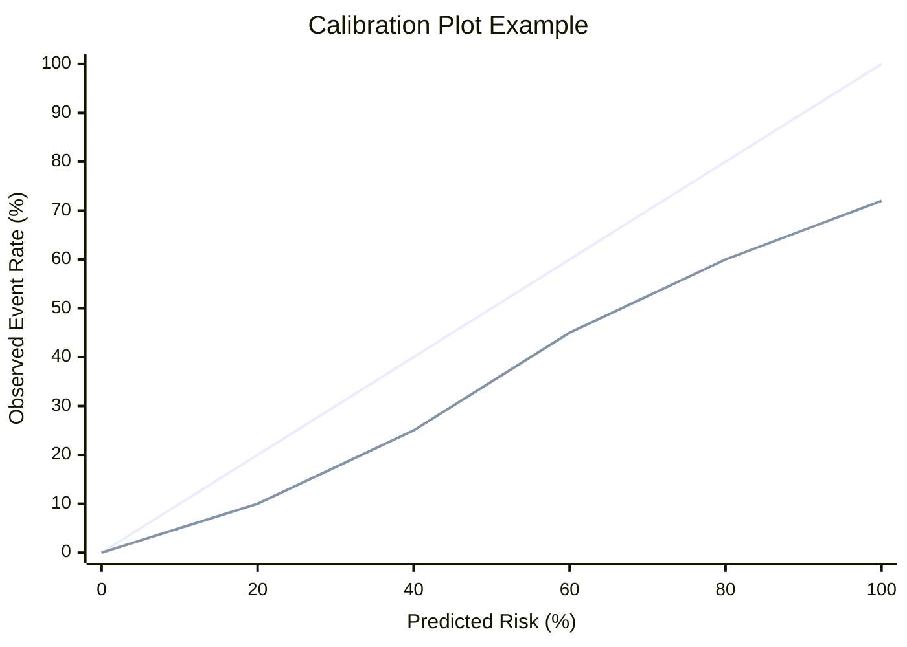

# Discrimination and Calibration

데이터 분포부터 임상 AI 지표, calibration과 모델 검토까지 하나의 평가 흐름으로 이해합니다.

---

## 07. AUROC and AUPRC

### Learning Goal

여러 임계값에서 모델의 순위 판별력을 비교하고, 클래스 불균형에서 ROC와 PR 지표가 다르게 보이는 이유를 이해한다.

### ROC Curve와 AUROC

ROC 곡선은 임계값을 바꾸며 다음 값을 그린다.

- X축: `FPR = FP / (FP + TN) = 1 - Specificity`
- Y축: `TPR = TP / (TP + FN) = Sensitivity`

AUROC는 ROC 곡선 아래 면적이다. 무작위 순위 모델은 일반적으로 0.5 부근이며, 1에 가까울수록 실제 양성에 실제 음성보다 높은 점수를 주는 경향이 강하다.

AUROC 0.9를 “90% 정확도”라고 해석하면 안 된다. 특정 임계값의 정확도도 아니고 확률의 보정도를 나타내지도 않는다.

원문에서 흔히 사용하는 거친 해석 예시는 다음과 같지만, 분야·표본·위험에 따라 기준은 달라져야 한다.

| AUROC | 매우 단순화한 해석 |
|---:|---|
| 0.5 | 무작위 순위 수준 |
| 0.7 | 제한적인 판별력 |
| 0.8 | 비교적 괜찮은 판별력 |
| 0.9 이상 | 높은 판별력 |

이 구간표를 승인 기준처럼 사용하면 안 된다. 임상적 유용성은 threshold별 오류, calibration, 외부 검증과 함께 판단한다.

### PR Curve와 AUPRC

PR 곡선은 임계값별 precision과 recall을 그린다.

- X축: `Recall = Sensitivity`
- Y축: `Precision = PPV`

AUPRC는 양성 클래스 탐지 품질에 집중한다. 양성이 희귀하고 FP 비용이 중요한 문제에서 AUROC보다 운영 현실을 더 잘 드러낼 수 있다.

예를 들어 환자의 1%만 양성이라면 높은 AUROC에도 양성 알림 대부분이 FP일 수 있다. PR curve는 recall을 높일 때 precision이 얼마나 떨어지는지 직접 보여준다.

### 불균형 데이터

음성이 압도적으로 많으면 FPR이 낮아 보여도 FP 절대 수가 클 수 있다. ROC는 TN을 분모로 사용하므로 이 문제를 덜 두드러지게 보일 수 있다. PR 곡선은 양성 예측 중 실제 양성 비율을 직접 포함한다.

| 지표 | 강점 | 주의점 |
|---|---|---|
| AUROC | 전반적인 순위 판별력 비교 | 불균형에서 운영 FP 부담을 가릴 수 있음 |
| AUPRC | 희귀 양성 탐지 품질에 민감 | 양성 비율에 크게 영향받음 |

### AUPRC Baseline

무작위 모델의 평균 precision 기준선은 대략 양성 비율이다. 양성률 1%에서 AUPRC 0.20은 절대값만 보면 낮아 보여도 baseline 0.01보다 큰 개선이다. 반대로 서로 다른 유병률의 데이터셋에서 AUPRC를 직접 비교하는 것은 조심해야 한다.

```text
Positive prevalence: 0.01
Random precision baseline: about 0.01
Model AUPRC: 0.20
```

0.20이라는 값만 볼 것이 아니라 기준선의 20배라는 맥락과 실제 threshold의 PPV를 함께 본다.

### 곡선 아래 면적 이후의 질문

면적은 모든 임계값을 요약하지만 실제 제품은 하나 또는 소수 임계값에서 동작한다. 최종 선택 지점의 sensitivity, specificity, PPV, NPV, 건수와 신뢰구간을 함께 보고해야 한다.

또한 성능 차이가 작다면 부트스트랩 신뢰구간이나 적절한 비교 방법으로 불확실성을 평가해야 한다. 같은 test set을 사용한 모델은 평가값이 서로 연관되어 있다.

### Technical Literacy Check

- AUROC를 정확도로 해석하면 안 되는 이유를 설명할 수 있는가?
- 불균형 데이터에서 AUPRC가 유용한 이유를 말할 수 있는가?
- AUPRC baseline이 양성 비율과 연결되는 이유를 이해하는가?

### What I learned

AUROC와 AUPRC는 하나의 임계값 결과가 아니라 점수의 순위 판별력을 여러 임계값에서 요약한다. 희귀 양성 문제에서는 baseline, 실제 운영 임계값과 오류 절대 수를 함께 봐야 한다.

### Questions I can now ask

- 양성 비율과 AUPRC baseline은 얼마인가?
- AUROC가 좋아도 운영 임계값에서 PPV와 FP 건수는 감당 가능한가?
- 두 모델의 차이에 신뢰구간이 있는가?
- 곡선 전체가 아니라 실제 사용할 영역에서 어느 모델이 나은가?

---

## 08. Calibration

### Learning Goal

환자 위험 순위를 잘 매기는 능력과 예측 확률이 실제 발생률에 맞는 능력을 구분한다.

### Discrimination vs Calibration

| 관점 | 질문 | 대표 지표 |
|---|---|---|
| Discrimination | 누가 더 위험한지 순위를 잘 매기는가? | AUROC, AUPRC |
| Calibration | 예측한 확률이 실제 발생률과 맞는가? | calibration plot, intercept/slope, Brier score |

모든 위험을 실제보다 두 배로 예측해도 순서는 정확할 수 있다. 이 모델은 AUROC가 높지만 확률은 과대평가할 수 있다.

### 직관적 정의

모델이 0.8을 예측한 사례들을 모았을 때 실제 사건 발생률도 약 80%여야 잘 보정된 것이다.

| 예측 | 관찰 | 해석 |
|---:|---:|---|
| 0.10 | 0.10 | 잘 맞음 |
| 0.80 | 0.40 | 위험 과대평가 |
| 0.30 | 0.60 | 위험 과소평가 |

모델이 모든 환자의 위험을 실제보다 두 배 높게 예측하더라도 고위험 환자에게 더 높은 순위를 준다면 AUROC는 높을 수 있다. 이 경우 discrimination은 좋지만 calibration은 나쁘다.

### Calibration Plot

예측 확률 구간별 평균 예측과 실제 발생률을 비교한다. 45도 선에 가까울수록 이상적이지만 표본이 적은 구간은 크게 흔들린다. 구간 수, smoothing 방법, 사건 수와 신뢰구간을 확인해야 한다.



모델 선이 45도 기준선보다 아래에 있다면 같은 예측 확률에서 실제 발생률이 더 낮아, 위험을 과대평가하는 패턴일 수 있다.

### Brier Score

```text
Brier score = mean((predicted probability - observed outcome)^2)
```

0에 가까울수록 좋지만 유병률과 데이터 난이도에 영향을 받는다. 판별력과 보정도를 함께 반영하므로 단독으로 원인을 설명하지 못한다. 기준 모델과 비교하거나 분해 지표를 함께 볼 수 있다.

실제 사건이 발생한 환자에게 0.9를 예측하면 제곱오차는 `(0.9-1)^2=0.01`이다. 같은 환자에게 0.1을 예측하면 `(0.1-1)^2=0.81`로 훨씬 크다.

### Recalibration

새 병원에서 유병률이 달라지면 모델의 순위 능력은 유지되어도 확률이 틀어질 수 있다. intercept 조정, logistic recalibration, isotonic regression 같은 방법을 사용할 수 있다. 재보정도 별도의 데이터에서 학습하고 독립 데이터로 평가해야 한다.

### 의료 AI에서의 중요성

확률이 상담, 집중 관리, 입원, 치료 같은 임계값 기반 행동을 결정한다면 보정 오류는 직접적인 과잉·과소 개입으로 이어진다. 위험군 분류만 제공하더라도 각 구간의 실제 사건률을 보고해야 의미를 알 수 있다.

| 예측 위험 기준 | 예시 의사결정 |
|---:|---|
| 10% 이상 | 추가 상담 |
| 30% 이상 | 집중 관리 |
| 50% 이상 | 입원 연장 검토 |

이런 정책에서는 예측 30%가 실제로 10%인지 30%인지에 따라 자원 배분과 환자 경험이 크게 달라진다.

운영 중 유병률과 진료 흐름이 변하면 calibration drift가 생길 수 있어 주기적으로 재평가한다.

### Technical Literacy Check

- 높은 AUROC와 잘 보정된 확률이 다른 개념임을 설명할 수 있는가?
- calibration plot이 45도 선 아래에 있을 때 가능한 해석을 말할 수 있는가?
- Brier score가 낮을수록 좋다는 것 외에 한계를 설명할 수 있는가?

### What I learned

좋은 순위 모델이 반드시 정확한 위험 확률을 주는 것은 아니다. 확률이 의사결정에 사용된다면 적용 집단에서 calibration을 별도로 검증하고 변화하는 환경에서 모니터링해야 한다.

### Questions I can now ask

- 예측 80% 집단의 실제 발생률은 얼마인가?
- calibration plot과 Brier score를 외부 데이터에서도 확인했는가?
- 재보정에 사용한 데이터와 최종 평가 데이터가 분리되었는가?
- 운영 중 calibration drift를 어떻게 감지하는가?

---

[이전: Classification Metrics](./02-classification-metrics.md) · [트랙 목차](./README.md) · [다음: Modeling, Interpretation, and Review](./04-modeling-interpretation-and-review.md)
