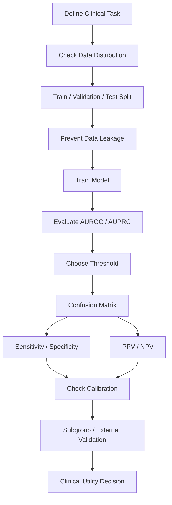

# Modeling, Interpretation, and Review

데이터 분포부터 임상 AI 지표, calibration과 모델 검토까지 하나의 평가 흐름으로 이해합니다.

---

## 09. Regression, p-value, and Interpretation

### Learning Goal

회귀모델의 설명 목적과 예측 목적을 구분하고, p-value·계수·오즈비가 답하는 질문과 답하지 못하는 질문을 이해한다.

### 선형 회귀

선형 회귀는 연속 결과를 입력 변수의 선형 조합으로 설명하거나 예측한다.

```text
y = intercept + beta1*x1 + beta2*x2 + error
```

계수는 다른 변수를 고정했을 때 입력이 1단위 변할 때 결과의 평균 변화로 해석한다. 이 해석은 모형 형태, 변수 단위, 상호작용과 교란 통제가 적절하다는 가정에 의존한다.

`R²`는 모델이 표본에서 설명하는 결과 변동의 비율이다. 변수를 추가하면 감소하지 않으므로 adjusted R²가 복잡도를 일부 보정한다. 높은 R²가 인과성이나 외부 예측력을 보장하지 않는다.

설명 목적에서는 “나이가 사망률과 관련되는가?”, “혈압이 입원 기간과 관련되는가?”, “특정 치료가 회복 속도와 관련되는가?” 같은 질문을 다룬다. 예측 목적에서는 개별 계수보다 새로운 환자에서의 오차와 calibration이 중요하다.

### 로지스틱 회귀와 오즈비

로지스틱 회귀는 이진 결과의 log-odds를 모델링한다. 계수를 지수화하면 오즈비(OR)가 된다.

OR 2는 해당 조건에서 사건의 **odds**가 2배라는 뜻이지 위험확률이 항상 2배라는 뜻은 아니다. 사건이 흔할수록 odds ratio와 risk ratio의 차이가 커진다.

```text
probability p = 0.20 -> odds = 0.20 / 0.80 = 0.25
probability p = 0.40 -> odds = 0.40 / 0.60 = 0.67
```

확률은 2배가 되었지만 odds는 약 2.67배다. OR을 risk ratio처럼 번역하면 과장될 수 있다.

### p-value

p-value는 귀무가설과 분석 가정 아래, 관찰값 이상으로 극단적인 결과가 나올 가능성을 나타낸다. “귀무가설이 참일 확률”이나 “결과가 우연일 확률” 그 자체가 아니다.

p-value가 답하지 않는 것:

- 효과가 얼마나 큰가?
- 예측 성능이 좋은가?
- 환자에게 유용한가?
- 다른 병원에서 재현되는가?
- 모델 확률이 보정되었는가?

큰 표본에서는 매우 작은 효과도 낮은 p-value를 얻을 수 있다. 효과 크기와 신뢰구간, 실무적으로 중요한 최소 차이를 함께 본다. 여러 가설을 반복하면 다중비교 문제도 고려한다.

예를 들어 기능 변경이 클릭률을 `0.01%p` 높였고 p-value가 `0.001`일 수 있다. 통계적으로는 우연만으로 설명하기 어려워도 개발·운영 비용을 감수할 만큼 큰 개선인지는 별도 질문이다.

### 설명 목적 vs 예측 목적

| 목적 | 핵심 질문 | 중점 평가 |
|---|---|---|
| 설명·연관성 | 어떤 변수가 결과와 관련되는가? | 계수, 효과 크기, CI, 가정 |
| 예측 | 새 환자를 얼마나 잘 예측하는가? | test 성능, calibration, 외부 검증 |
| 인과 | 개입하면 결과가 바뀌는가? | 연구 설계, 교란 통제, 인과 가정 |

예측 모델에서 변수 p-value가 높다고 자동 제거하거나, 중요도가 높다고 원인으로 해석하면 안 된다.

### Prediction Is Not Causation

산소치료 환자의 사망률이 높다고 산소치료가 사망 원인이라고 결론 내릴 수 없다. 중증도가 치료와 사망 모두에 영향을 주는 교란변수일 수 있다. 인과 질문에는 무작위시험, DAG, 성향점수, 도구변수 등 별도 설계가 필요하다.

| 질문 유형 | 예시 |
|---|---|
| Prediction | 이 환자는 재입원할 가능성이 높은가? |
| Causation | 이 치료가 재입원을 줄이는가? |

인과 추론 심화에는 무작위 대조시험, confounder, selection bias, propensity score, instrumental variable, Difference-in-Differences, DAG가 포함된다. 이는 예측 평가와 연결되지만 별도의 학습 주제다.

### Technical Literacy Check

- odds와 risk의 차이를 설명할 수 있는가?
- p-value가 효과 크기나 예측력을 말하지 않는다는 점을 이해하는가?
- 예측, 설명, 인과 질문을 구분할 수 있는가?

### What I learned

회귀분석은 같은 형태의 모델이라도 목적에 따라 평가 기준이 달라진다. p-value와 계수는 연관성 분석의 일부이며, 새로운 환자 예측과 개입 효과를 별도로 증명하지 않는다.

### Questions I can now ask

- 이 분석의 목적은 설명, 예측, 인과 중 무엇인가?
- p-value와 함께 효과 크기 및 신뢰구간을 보고했는가?
- OR을 위험비처럼 과장해 해석하지 않았는가?
- 예측 모델은 독립 test와 외부 데이터에서 평가했는가?

---

## 10. Decision Tree and Random Forest

### Learning Goal

의사결정나무와 랜덤포레스트의 학습 원리, 과적합 위험, 해석 한계를 회귀모델과 비교한다.

### Decision Tree

의사결정나무는 변수와 기준값으로 데이터를 반복 분할한다.

```text
Age > 65?
├── Yes -> Biomarker > threshold? -> High / Medium risk
└── No  -> Previous admission?    -> Medium / Low risk
```

분류 트리는 각 노드의 클래스 혼합 정도를 줄이는 분할을 찾는다. Gini impurity나 entropy를 사용할 수 있다. 회귀 트리는 평균제곱오차 감소 등을 기준으로 분할한다. CART는 대표적인 이진 분할 알고리즘이다.

#### 장점

- 비선형 관계와 변수 상호작용을 자동 포착
- 스케일링 요구가 비교적 적음
- 작은 트리는 규칙을 시각적으로 설명 가능

#### 한계

- 깊게 자라면 train 데이터에 과적합
- 작은 데이터 변화에도 구조가 크게 바뀔 수 있음
- 축에 평행한 단계적 경계를 사용
- leaf의 확률이 거칠고 보정이 나쁠 수 있음

깊이, 최소 leaf 샘플 수, 가지치기 등을 validation에서 조정한다.

### Random Forest

랜덤포레스트는 서로 다른 bootstrap 표본과 무작위 변수 부분집합으로 여러 트리를 만든 뒤 예측을 평균하거나 투표한다. 이를 bagging이라고 한다.

트리들이 완전히 같은 실수를 하지 않게 만들어 단일 트리의 높은 분산을 줄인다. 일반적으로 단일 트리보다 안정적이지만 모델 전체를 한 규칙표로 설명하기 어렵다.

### OOB Error

각 bootstrap 표본에 선택되지 않은 데이터(out-of-bag)를 해당 트리의 평가에 사용할 수 있다. OOB 평가는 편리한 내부 추정치지만 최종 독립 test와 외부 검증을 대체하지 않는다.

### Feature Importance 주의점

- impurity 기반 중요도는 연속값 또는 범주가 많은 변수에 편향될 수 있다.
- 상관된 변수끼리 중요도를 나누어 가질 수 있다.
- permutation importance는 평가 데이터와 지표 선택에 의존한다.
- 높은 중요도는 인과 효과를 의미하지 않는다.

### 회귀모델과의 선택

| 기준 | 선형/로지스틱 회귀 | Random Forest |
|---|---|---|
| 관계 형태 | 사전 지정한 선형 구조 | 복잡한 비선형·상호작용 |
| 해석 | 계수 기반으로 비교적 명확 | 전역 해석이 어려움 |
| 표본 효율 | 적절한 가정에서 강점 | 충분한 데이터가 유리 |
| 전처리 | 스케일·함수 형태 고려 | 스케일에 덜 민감 |
| 목표 | 설명과 예측 모두 가능 | 주로 예측에 강점 |

모델 선택은 이름이나 복잡도가 아니라 독립 성능, calibration, 해석 가능성, 배포 비용과 안전 요구를 기준으로 한다.

### Technical Literacy Check

- 단일 트리가 과적합하기 쉬운 이유를 설명할 수 있는가?
- bagging과 무작위 변수 선택이 분산을 줄이는 원리를 이해하는가?
- feature importance를 인과 효과로 해석하면 안 되는 이유를 말할 수 있는가?

### What I learned

랜덤포레스트는 여러 불안정한 트리를 결합해 더 안정적인 예측을 만든다. 그러나 성능 향상이 자동으로 해석 가능성이나 calibration을 보장하지 않으며, 최종 선택은 실제 목적과 독립 평가에 달려 있다.

### Questions I can now ask

- 트리 깊이와 leaf 크기는 어떤 데이터로 튜닝했는가?
- OOB 결과 외에 독립 test와 외부 검증이 있는가?
- 예측 확률의 calibration을 확인했는가?
- 중요도 해석이 상관 변수와 데이터 누수의 영향을 받지 않았는가?

---

## 11. Summary and Evaluation Checklist

### Core Concepts

| 개념 | 기억할 질문 |
|---|---|
| 분포 | 평균 뒤에 어떤 퍼짐, 치우침, 이상치가 있는가? |
| 확률 | 모델 점수가 실제 발생률과 맞는가? |
| 조건부확률 | 조건의 방향과 기본률을 올바르게 보았는가? |
| 데이터 분할 | test가 학습·튜닝과 독립적인가? |
| 혼동 행렬 | 모델은 어떤 방향으로 틀리는가? |
| 민감도·특이도 | 실제 양성과 음성을 각각 얼마나 잘 다루는가? |
| PPV·NPV | 양성·음성 결과를 실제로 얼마나 믿을 수 있는가? |
| AUROC·AUPRC | 순위 판별력과 불균형 문제를 함께 보았는가? |
| Calibration | 위험 확률이 실제 발생률과 맞는가? |
| p-value | 효과 크기와 실무적 중요성을 혼동하지 않았는가? |
| 예측 vs 인과 | 위험한 사람 찾기와 개입 효과를 구분했는가? |

### Clinical AI Evaluation Flow



평가는 한 지표로 끝나지 않는다. 판별력, threshold별 오류, 결과의 실제 신뢰도, 확률 보정, 다른 환경에서의 재현성과 실제 업무 변화를 순서대로 연결한다.

### End-to-End Evaluation Checklist

#### 1. Prediction Task

- 대상 환자, 예측 시점, 결과, 예측 기간이 명확한가?
- 모델 결과가 실제로 어떤 결정을 바꾸는가?
- FP와 FN의 임상·운영 비용을 정의했는가?

#### 2. Data

- 양성 비율, 결측, 이상치와 하위집단 분포를 확인했는가?
- 같은 환자·중복 샘플이 train/test에 섞이지 않았는가?
- 예측 이후 정보와 라벨 대리 변수가 포함되지 않았는가?
- 전처리와 feature selection을 train에서만 fit했는가?

#### 3. Performance

- 정확도 외에 혼동 행렬을 보고했는가?
- AUROC와 AUPRC를 양성 비율 및 baseline과 함께 봤는가?
- 운영 임계값의 sensitivity, specificity, PPV, NPV가 있는가?
- 점추정치와 함께 표본 수 및 신뢰구간을 보고했는가?

#### 4. Reliability and Usefulness

- calibration plot과 확률 평가가 있는가?
- 외부 기관, 이후 시점, 중요 하위집단에서 검증했는가?
- 하루 예상 알림 수와 후속 업무 용량을 계산했는가?
- 모델 실패 시 사람의 검토와 안전장치가 있는가?

#### 5. Monitoring

- 입력 분포, 유병률, 성능, calibration 변화를 추적하는가?
- 정답 라벨이 늦게 도착할 때 평가 계획이 있는가?
- 재학습·재보정·중단 기준과 책임자가 정해졌는가?

### Questions for a Model Review Meeting

1. 이 모델은 정확히 누구에 대해 언제 무엇을 예측합니까?
2. test set은 환자·기관·시간 기준으로 독립적입니까?
3. 양성률과 AUPRC baseline은 얼마입니까?
4. 임계값은 어떤 오류 비용과 업무 용량으로 선택했습니까?
5. 양성 100건 중 실제 양성은 몇 건입니까?
6. 예측 80% 집단에서 실제 사건률도 약 80%입니까?
7. 어떤 하위집단과 외부 기관에서 성능이 가장 낮습니까?
8. 모델이 실패하면 누가 어떤 방식으로 개입합니까?

#### Data Questions

- 양성 비율과 결측 비율은 얼마인가?
- 학습 데이터와 운영 데이터의 분포가 비슷한가?
- 같은 환자 또는 중복 샘플이 train/test에 함께 있는가?
- 예측 시점 이후 정보가 feature에 포함되었는가?

#### Metric Questions

- 정확도 외에 sensitivity, specificity, PPV, NPV는 얼마인가?
- AUROC와 AUPRC를 모두 보고 AUPRC baseline을 제시했는가?
- threshold는 어떤 FN·FP 비용으로 정했는가?
- 비율뿐 아니라 하루 예상 오류 건수를 계산했는가?

#### Calibration Questions

- 예측 80% 집단의 실제 사건률도 약 80%인가?
- calibration plot에서 과대·과소평가 구간은 어디인가?
- 확률값을 실제 의사결정 기준으로 사용해도 되는가?

#### Clinical Utility Questions

- 모델 결과가 어떤 업무와 결정을 바꾸는가?
- 과도한 양성 알림이 alert fatigue를 만들지 않는가?
- 성별, 연령, 기관, 질환군별 성능 차이는 무엇인가?
- 외부 병원 검증과 실패 시 안전장치가 있는가?

### Final Takeaway

통계 문해력은 복잡한 공식을 외우는 능력보다 성능 숫자의 조건과 한계를 질문하는 능력에 가깝다. “정확도 95%”라는 문장만으로 모델의 안전성이나 유용성을 판단할 수 없다.

신뢰할 수 있는 평가는 독립적인 데이터 분할에서 시작해 판별력, 임계값별 오류, PPV·NPV, calibration, 외부·하위집단 검증, 실제 업무 영향으로 이어진다. 예측 모델의 목표는 좋아 보이는 숫자가 아니라 실제 환경에서 일관되고 안전하게 더 나은 결정을 돕는 것이다.

### What I learned

모델 평가는 단일 지표 선택이 아니라 데이터 생성부터 실제 의사결정까지 이어지는 검증 과정이다. 각 숫자가 말하는 것과 말하지 않는 것을 구분해야 기술팀과 임상팀 사이에서 정확히 소통할 수 있다.

---

[이전: Discrimination and Calibration](./03-discrimination-and-calibration.md) · [트랙 목차](./README.md)
