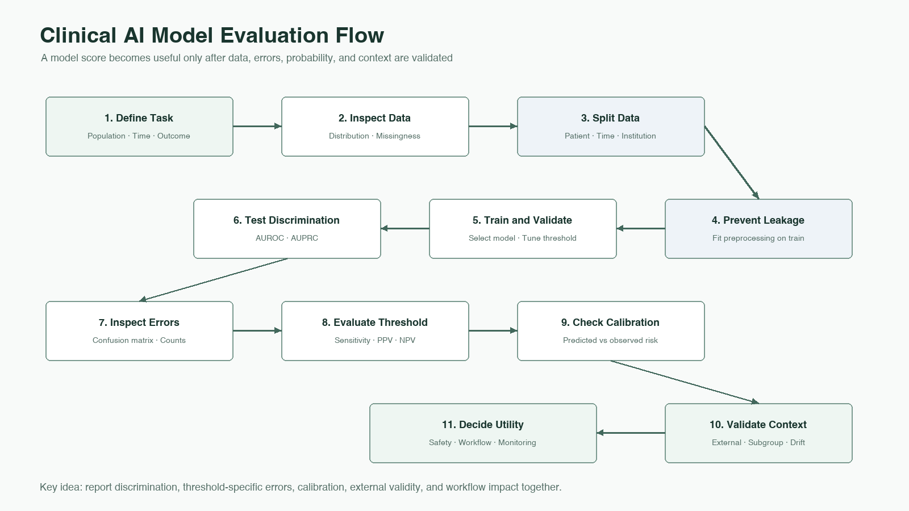

# Statistics for AI Literacy

데이터 분포부터 임상 AI 지표, calibration과 모델 검토까지 하나의 평가 흐름으로 이해합니다.

## Contents

1. [Data, Probability, and Validation](./01-data-probability-and-validation.md)
   - 01. Data Distribution · 02. Probability and Conditional Probability · 03. Train/Test Split and Data Leakage
2. [Classification Metrics](./02-classification-metrics.md)
   - 04. Confusion Matrix · 05. Sensitivity and Specificity · 06. PPV, NPV, and Prevalence
3. [Discrimination and Calibration](./03-discrimination-and-calibration.md)
   - 07. AUROC and AUPRC · 08. Calibration
4. [Modeling, Interpretation, and Review](./04-modeling-interpretation-and-review.md)
   - 09. Regression, p-value, and Interpretation · 10. Decision Tree and Random Forest · 11. Summary and Evaluation Checklist

## Reading Guide

각 통합 문서는 서로 연관된 기존 장을 한 학습 단위로 묶었습니다. 문서 내부의 구분선과 장 제목을 이용하면 기존 세부 주제를 그대로 찾아볼 수 있습니다.

[전체 프로젝트로 돌아가기](../../README.md) · [References](../../references/statistics-for-ai.md)
