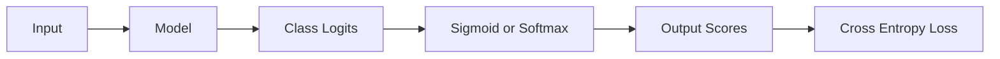

# Functions, Scores, and Probabilities

함수와 확률 출력, 벡터·텐서, loss와 최적화를 AI 모델의 계산 흐름으로 연결합니다.

---

## 01. Functions and Models

### Learning Goal

AI 모델을 입력을 출력으로 바꾸는 파라미터화된 함수로 보고, 학습·추론·일반화를 구분한다.

### 함수란 무엇인가

함수는 입력마다 정해진 규칙에 따라 출력을 대응시킨다.

```text
x -> f -> y
f(x) = 2x + 1
f(3) = 7
```

입력과 출력은 숫자 하나일 수도 있고 벡터·행렬·텐서일 수도 있다. 중요한 것은 함수가 허용하는 입력 영역(domain), 출력 영역(codomain), 변환 규칙이다.

### AI 모델도 함수다

```text
Patient features -> Risk model -> Risk score
Image pixels     -> Classifier -> Class scores
Token sequence   -> Language model -> Next-token scores
```

조금 더 구체적으로 보면 입력과 출력의 종류만 달라질 뿐 구조는 같다.

| 모델 사례 | 입력 | 출력 |
|---|---|---|
| 의료 위험 예측 | 나이, 혈압, 혈당, 체온 | 질병 또는 재입원 위험 점수 |
| 이미지 분류 | 픽셀값의 다차원 배열 | 고양이·강아지 등 클래스 점수 |
| 언어 모델 | token ID의 sequence | 다음 token별 점수 |
| 추천 모델 | 사용자·상품·행동 정보 | 상품별 선호 점수 |

이미지나 문장을 모델이 원래 모습 그대로 이해하는 것은 아니다. 전처리와 embedding을 거쳐 숫자 배열로 바뀐 뒤 함수에 입력된다.

모델을 `f(x; θ)`로 쓰면 `x`는 입력, `θ`는 학습 가능한 파라미터다. 같은 입력이라도 파라미터가 달라지면 출력이 달라진다.

- **파라미터**: 학습으로 조정되는 weight와 bias
- **하이퍼파라미터**: 사람이 선택하거나 탐색하는 learning rate, layer 수 등
- **출력**: score, logit, probability, predicted value 등

### 학습과 추론

- **학습(training)**: 데이터와 정답을 이용해 loss를 줄이도록 파라미터를 변경
- **추론(inference)**: 학습된 파라미터를 고정하고 새 입력의 출력을 계산

학습 성능이 좋다는 사실만으로 새 데이터에서도 잘 작동한다고 말할 수 없다. 모델의 목적은 과거 샘플을 외우는 것이 아니라 보지 못한 데이터에 일반화하는 것이다.

#### 학습은 함수의 모양을 조정하는 일

처음의 모델은 좋은 weight와 bias를 알지 못한다. 예측, 정답 비교, 파라미터 수정 과정을 반복하며 입력과 출력의 관계를 맞춰 간다.

- 함수: 문제를 푸는 전체 방식
- 파라미터: 방식 안에서 조절할 수 있는 숫자
- loss: 현재 함수가 얼마나 틀렸는지 나타내는 기준
- 학습: loss가 작아지도록 파라미터를 조정하는 과정

따라서 “모델이 배웠다”는 표현은 사람이 개념을 이해한 것과 동일한 뜻이 아니라, 학습 데이터의 패턴에 맞도록 함수의 수치 파라미터가 바뀌었다는 뜻이다.

### 함수의 합성

신경망은 여러 함수를 순서대로 합성한 구조다.

```text
f(x) = f3(f2(f1(x)))
```

한 layer의 출력이 다음 layer의 입력이 된다. 각 layer는 선형 변환과 비선형 활성화를 결합할 수 있다. 깊은 모델은 단순 변환을 여러 번 합성해 복잡한 패턴을 표현한다.

### 결정론과 확률성

추론 모드의 일반적인 모델은 같은 입력과 파라미터에 같은 점수를 낸다. 하지만 샘플링을 사용하는 언어 모델, dropout이 켜진 학습, 무작위 증강에서는 출력이 달라질 수 있다. “모델이 함수”라는 관점과 실행 과정의 무작위성은 양립한다.

### Technical Literacy Check

- 모델 식 `f(x; θ)`에서 입력과 파라미터를 구분할 수 있는가?
- 학습과 추론의 차이를 설명할 수 있는가?
- 신경망을 함수의 합성으로 설명할 수 있는가?

### What I learned

AI 모델은 데이터를 숫자로 받아 변환하는 파라미터화된 함수다. 학습은 함수 내부 파라미터를 조정하는 과정이고, 평가는 그 함수가 보지 못한 입력에도 일반화하는지 확인하는 과정이다.

### Questions I can now ask

- 이 모델의 입력과 출력은 각각 무엇이며 shape은 어떻게 되는가?
- 학습되는 파라미터와 사람이 정하는 하이퍼파라미터는 무엇인가?
- 추론 중 무작위성이 있는가?
- train 성능이 아니라 새 데이터 일반화는 어떻게 검증했는가?

---

## 02. Linear Equations, Weight, and Bias

### Learning Goal

선형·아핀 변환에서 weight와 bias의 역할을 이해하고, 비선형 활성화가 깊은 모델에 필요한 이유를 설명한다.

### 기본식

```text
y = wx + b
```

| 기호 | 의미 | 모델에서의 역할 |
|---|---|---|
| `x` | 입력 | feature 또는 이전 layer 출력 |
| `w` | weight | 입력의 크기·방향을 변환하는 파라미터 |
| `b` | bias | 기준점을 이동하는 파라미터 |
| `y` | 출력 | 다음 계산으로 전달할 score |

엄밀히는 bias가 포함된 `wx+b`는 선형 변환이 아니라 아핀 변환이지만, ML 문맥에서는 흔히 linear layer라고 부른다.

### 여러 입력

```text
y = w1*x1 + w2*x2 + ... + wn*xn + b
y = w · x + b
```

weight는 입력의 단위와 스케일에 따라 값이 달라지므로 “절댓값이 크면 무조건 더 중요한 변수”라고 해석하면 안 된다. 상관된 변수, 정규화, 비선형 layer도 해석에 영향을 준다.

#### 의료 위험 점수 예시

```text
risk score = 0.8 * age + 1.5 * glucose + 2.0 * temperature - 10
```

이 단순 예시에서 `0.8`, `1.5`, `2.0`은 각 입력에 곱해지는 weight이고 `-10`은 bias다. 다만 이 숫자만 보고 혈당이 나이보다 “더 중요하다”고 단정할 수는 없다. 나이는 년, 혈당은 mg/dL, 체온은 섭씨처럼 단위와 값의 범위가 다르기 때문이다. 공정한 비교에는 scaling과 모델 구조를 함께 확인해야 한다.

### Bias의 역할

bias는 입력이 0일 때의 기준 출력을 조정하고 결정 경계를 원점에 고정하지 않게 한다. 그래프에서는 직선이나 평면을 평행 이동시키는 효과가 있다.

### 선형 변환만 쌓으면 생기는 한계

두 선형 변환을 합성해도 결과는 다시 하나의 선형 변환으로 정리된다.

```text
W2(W1x) = (W2W1)x
```

따라서 layer 수만 늘리고 비선형 함수를 넣지 않으면 깊은 네트워크의 표현력이 생기지 않는다.

예를 들어 체온이 37.5도까지는 위험 변화가 작지만 38.5도를 넘으면 위험이 급격히 증가하는 관계는 하나의 직선으로 표현하기 어렵다. 혈압도 너무 낮거나 너무 높은 양쪽이 위험한 U자형 관계를 가질 수 있다. 이런 굴곡과 구간별 변화를 표현하려고 선형 변환 사이에 비선형 activation을 넣는다.

### Activation Function

활성화 함수는 선형 출력에 비선형성을 추가한다.

| 함수 | 직관 | 주의점 |
|---|---|---|
| ReLU | 음수는 0, 양수는 유지 | 음수 영역 gradient 0 가능 |
| Sigmoid | 값을 0~1로 압축 | 큰 절댓값에서 gradient가 작아짐 |
| Tanh | 값을 -1~1로 압축 | 포화 영역 존재 |
| GELU | 입력 크기에 따라 부드럽게 통과 | Transformer 계열에서 자주 사용 |

출력층의 활성화는 문제 유형과 loss가 결정한다. 은닉층의 활성화와 최종 확률 변환을 구분해야 한다.

### Feature Scaling

나이와 혈당처럼 단위가 다른 입력은 최적화 속도와 계수 해석에 영향을 준다. 표준화는 평균을 빼고 표준편차로 나누어 스케일을 맞추는 대표적 방법이다. 트리 모델은 상대적으로 덜 민감하지만 거리·gradient 기반 모델은 크게 영향받을 수 있다.

### Technical Literacy Check

- weight와 bias의 역할을 그래프 이동 관점에서 설명할 수 있는가?
- 선형 layer만 여러 개 쌓아도 복잡한 비선형 모델이 되지 않는 이유를 아는가?
- coefficient 크기와 변수 중요도를 단순 동일시하면 안 되는 이유를 말할 수 있는가?

### What I learned

모델 계산의 기본은 입력을 weight로 변환하고 bias로 기준점을 옮기는 것이다. 비선형 활성화가 결합되어야 여러 layer가 복잡한 관계를 표현할 수 있다.

### Questions I can now ask

- 이 layer의 input/output dimension은 무엇인가?
- 어떤 activation을 왜 사용했는가?
- 입력 feature의 단위와 scaling은 어떻게 처리했는가?
- 최종 layer의 score는 logit인가 probability인가?

---

## 03. Exponential and Logarithm

### Learning Goal

지수와 로그의 역관계, 확률 곱셈을 로그 합으로 바꾸는 이유, 수치적으로 안정한 계산이 필요한 이유를 이해한다.

### 지수

지수 함수는 일정한 비율로 증가하거나 감소하는 변화를 표현한다.

| x | `2^x` |
|---:|---:|
| 0 | 1 |
| 1 | 2 |
| 2 | 4 |
| 3 | 8 |

`2^4=16`처럼 입력이 1 늘 때마다 값이 같은 비율로 커진다. 선형 증가가 일정한 양을 더하는 것이라면 지수 증가는 일정한 배율을 곱한다. softmax가 지수를 쓰면 logit 차이가 확률 비율 차이로 강조된다.

자연상수 `e`를 밑으로 하는 `exp(x)=e^x`는 미분해도 자기 자신이라는 성질 때문에 확률·최적화에서 널리 쓰인다. 지수는 모든 입력을 양수로 만들고 점수 차이를 비율 차이로 변환한다.

### 로그

로그는 지수의 역함수다.

```text
2^3 = 8  <->  log2(8) = 3
log(a*b) = log(a) + log(b)
```

독립 사건 확률을 여러 번 곱하면 값이 매우 작아진다. 로그를 취하면 곱셈이 덧셈이 되어 계산과 최적화가 쉬워진다.

### Negative Log-Likelihood

정답에 모델이 부여한 확률을 `p`라 하면 분류 loss의 핵심은 `-log(p)`다.

| p | `-log(p)`의 경향 |
|---:|---|
| 0.99 | 매우 작음 |
| 0.50 | 중간 |
| 0.01 | 매우 큼 |

정답 확률이 0에 가까워질수록 벌점이 급격히 증가해, 확신하고 틀린 예측을 강하게 교정한다.

실제 정답이 양성인 두 예측을 비교해 보자.

| 양성 예측 확률 | 해석 | `-log(p)`의 대략적 크기 |
|---:|---|---:|
| 0.90 | 정답에 높은 확률 | 0.11 |
| 0.50 | 불확실 | 0.69 |
| 0.10 | 정답에 낮은 확률 | 2.30 |
| 0.01 | 확신하고 틀림 | 4.61 |

확률이 0.1에서 0.01로 10배 줄면 negative log-loss에는 일정량이 더해진다. 로그가 확률 비율을 덧셈 가능한 벌점으로 바꾸는 모습이다.

### Log-odds

확률 `p`의 odds는 `p/(1-p)`, log-odds 또는 logit은 다음과 같다.

```text
logit(p) = log(p / (1-p))
```

0~1의 확률을 제한 없는 실수 범위로 옮긴다. sigmoid는 이 변환의 역함수다. 로지스틱 회귀가 선형식을 log-odds에 적용하는 이유를 연결해 이해할 수 있다.

### Numerical Stability

컴퓨터의 숫자 표현 범위는 유한하다. 매우 큰 값의 지수는 overflow, 매우 작은 확률의 곱은 underflow를 만들 수 있다.

- softmax 전에 최대 logit을 빼도 결과 확률은 같고 overflow 위험은 줄어든다.
- 확률을 먼저 계산한 뒤 log를 취하기보다 `log-softmax` 같은 결합 연산을 쓴다.
- `log(0)`을 피하려고 임의 처리를 하기보다 검증된 라이브러리 loss를 사용한다.

수식상 같은 표현도 컴퓨터에서는 안정성이 다를 수 있다.

### Technical Literacy Check

- 로그가 확률의 곱을 합으로 바꾸는 이유를 설명할 수 있는가?
- `-log(p)`가 확신하고 틀린 예측을 크게 벌주는 이유를 아는가?
- 수학적으로 같은 softmax 식도 구현에서 overflow가 날 수 있음을 이해하는가?

### What I learned

지수는 점수를 양의 비율로 바꾸고, 로그는 작은 확률들의 곱을 안정적인 합으로 바꾼다. AI 수학은 공식뿐 아니라 제한된 정밀도의 컴퓨터에서 같은 계산을 안전하게 수행하는 방식까지 포함한다.

### Questions I can now ask

- 이 값은 probability인가 log-probability인가?
- loss 구현이 log-softmax 등 안정적인 결합 연산을 쓰는가?
- NaN이나 overflow가 발생한 layer는 어디인가?
- logit과 log-odds를 probability와 혼동하고 있지 않은가?

---

## 04. Sigmoid and Softmax

### Learning Goal

logit을 0~1 값으로 변환하는 sigmoid와 여러 클래스 점수를 분포로 정규화하는 softmax를 구분한다.

### Sigmoid

```text
sigmoid(z) = 1 / (1 + exp(-z))
```

| logit z | 출력 경향 |
|---:|---|
| 매우 작음 | 0에 가까움 |
| 0 | 0.5 |
| 매우 큼 | 1에 가까움 |

이진 분류에서는 `z = w·x+b`를 sigmoid로 변환한다. 출력이 0~1 범위여도 실제 사건 확률로 믿으려면 별도의 calibration 검증이 필요하다.

#### 입력 점수 변환 예시

| logit | sigmoid 출력(약) | 직관 |
|---:|---:|---|
| -10 | 0.00005 | 거의 0 |
| -3 | 0.047 | 음성 쪽 |
| 0 | 0.500 | 중립점 |
| 2 | 0.881 | 양성 쪽 |
| 8 | 0.9997 | 거의 1 |

sigmoid는 범위를 압축하지만 최종 class를 정하지는 않는다. 예측값 0.8은 threshold가 0.5면 양성, 0.9면 음성이다. 확률 출력과 의사결정 규칙을 분리해야 한다.

### Softmax

클래스별 logit `z_i`를 다음처럼 변환한다.

```text
softmax(z_i) = exp(z_i) / sum_j exp(z_j)
```

모든 출력이 양수이고 합이 1이다. 각 logit에 같은 상수를 더하거나 빼도 결과는 변하지 않는다. softmax는 절대 점수보다 클래스 사이 상대 차이에 반응한다.

#### 다중 클래스 예시

| 클래스 | raw logit | softmax 확률(약) |
|---|---:|---:|
| 고양이 | 2.0 | 0.66 |
| 강아지 | 1.0 | 0.24 |
| 토끼 | 0.1 | 0.10 |

raw logit은 음수도 가능하고 합이 1일 필요도 없다. softmax 이후에만 세 값이 비교 가능한 분포 형태가 된다.

### 언제 무엇을 쓰는가

| 문제 | 출력 | 일반적 선택 |
|---|---|---|
| 서로 배타적인 2개 클래스 | 양성 확률 하나 | sigmoid |
| 서로 배타적인 여러 클래스 | 합이 1인 분포 | softmax |
| 여러 label이 동시에 가능 | label별 독립 확률 | 각 label에 sigmoid |

흉부 영상에서 폐렴과 흉수를 동시에 가질 수 있다면 multi-label 문제이며 softmax보다 label별 sigmoid가 자연스럽다.



### Temperature

softmax 입력을 temperature `T`로 나누면 분포의 날카로움을 조절한다.

- `T < 1`: 큰 점수에 더 집중
- `T > 1`: 더 평평한 분포

언어 모델 샘플링의 temperature와 확률 calibration을 위한 temperature scaling은 수식이 비슷하지만 목적과 적용 단계가 다르다.

### Saturation과 Gradient

sigmoid 입력 절댓값이 매우 크면 출력이 0 또는 1에 가까워지고 gradient가 작아진다. 깊은 은닉층에서 학습이 느려지는 vanishing gradient 원인이 될 수 있어 ReLU·GELU 같은 활성화를 많이 사용한다.

### Probability가 말하지 않는 것

softmax 0.99는 모델 내부 클래스 간 상대 확신이지 정답일 99% 보장을 뜻하지 않는다. 새로운 유형의 입력에도 기존 클래스 중 하나에 높은 값을 줄 수 있다. 분포 밖 입력 탐지와 calibration은 별도 문제다.

### Technical Literacy Check

- exclusive multi-class와 multi-label 문제의 출력 함수를 구분할 수 있는가?
- softmax 합이 1이라는 사실이 현실 확률 정확성을 보장하지 않는 이유를 아는가?
- temperature가 분포 모양에 미치는 영향을 설명할 수 있는가?

### What I learned

sigmoid와 softmax는 logit을 해석 가능한 범위로 변환하지만 사용 조건이 다르다. 출력 형태가 확률처럼 보이는 것과 실제 위험도가 정확히 보정된 것은 별개다.

### Questions I can now ask

- 이 과제는 binary, multi-class, multi-label 중 무엇인가?
- 모델 API가 logits과 probabilities 중 무엇을 반환하는가?
- temperature는 샘플링용인가 calibration용인가?
- 외부 데이터에서 probability calibration을 확인했는가?

---

[트랙 목차](./README.md) · [다음: Loss and Optimization](./02-loss-and-optimization.md)
