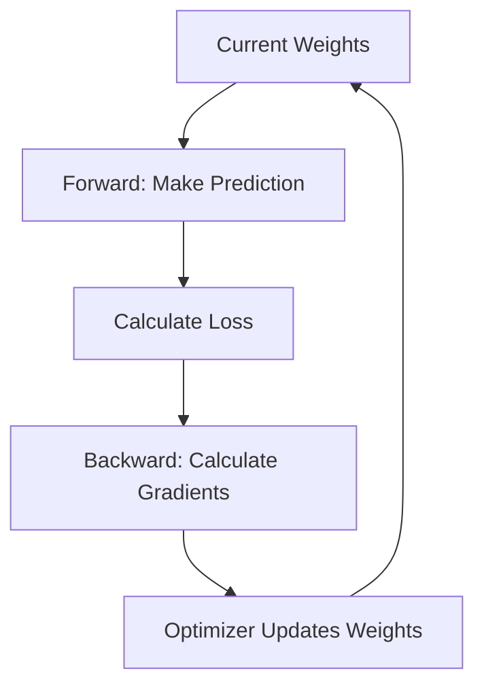

# Loss and Optimization

함수와 확률 출력, 벡터·텐서, loss와 최적화를 AI 모델의 계산 흐름으로 연결합니다.

---

## 05. Loss Functions and Cross Entropy

### Learning Goal

학습 목적함수와 실제 평가 지표를 구분하고, 회귀·분류 문제의 대표 loss와 regularization을 이해한다.

### Loss란 무엇인가

loss는 한 예측 또는 batch에서 모델 출력과 목표의 차이를 숫자로 표현한다. 학습 알고리즘은 평균 loss를 줄이도록 파라미터를 갱신한다.

```text
Prediction -> Loss(prediction, target) -> Scalar
```

loss가 감소한다고 임상 유용성이나 test 성능이 자동으로 좋아지는 것은 아니다. loss는 학습을 위한 대리 목표이며 실제 평가는 독립 데이터의 적절한 지표로 수행한다.

### Regression Loss

| Loss | 핵심 | 특성 |
|---|---|---|
| MSE | 오차 제곱 평균 | 큰 오차에 강한 벌점, 이상치 민감 |
| MAE | 절대 오차 평균 | 이상치에 상대적으로 견고, 단위 해석 쉬움 |
| Huber | 작은 오차는 제곱, 큰 오차는 절대값 | MSE와 MAE의 절충 |

loss 선택은 어떤 오류를 더 크게 비용 처리할지에 대한 가정을 담는다.

입원 기간의 실제값이 10일이고 예측값이 8일이면 오차는 `8-10=-2`, 제곱오차는 `4`다. 여러 환자의 제곱오차를 평균낸 것이 MSE다. MSE는 집값, 입원 기간, 혈당 수치, 매출처럼 연속값을 예측할 때 사용할 수 있다.

큰 오차를 제곱하므로 1일씩 네 번 틀린 경우보다 4일 한 번 틀린 경우에 더 큰 벌점을 준다. 이 성질이 목적에 맞는지 확인해야 한다.

### Binary Cross Entropy

실제 label `y`와 예측 확률 `p`에 대해 다음 형태를 갖는다.

```text
L = -[y log(p) + (1-y) log(1-p)]
```

정답 클래스에 낮은 확률을 줄수록 loss가 커진다. 실제 구현은 수치 안정성을 위해 sigmoid와 BCE를 합친 logits 기반 함수를 사용한다.

실제 정답이 양성일 때 다음처럼 읽을 수 있다.

| 양성에 준 확률 | 평가 |
|---:|---|
| 0.99 | 매우 좋은 예측 |
| 0.80 | 좋은 예측 |
| 0.50 | 불확실 |
| 0.10 | 나쁜 예측 |
| 0.01 | 확신하고 틀린 예측 |

의료 사례에서 실제 암 환자에게 암 확률 0.01을 주면 단순 오분류를 넘어 위험한 확신이다. cross entropy는 이런 예측에 특히 큰 loss를 부여한다.

### Multi-class Cross Entropy

softmax 분포에서 정답 클래스의 negative log-probability를 최소화한다. 프레임워크의 cross entropy 함수는 보통 raw logits를 입력받아 내부에서 안정적인 log-softmax를 계산하므로 softmax를 미리 중복 적용하면 안 된다.

### Class Imbalance

희귀 양성 문제에서는 다수 음성이 loss를 지배할 수 있다. class weight, focal loss, sampling 등을 고려할 수 있지만 각각 probability calibration과 분산에 영향을 줄 수 있다. 변경 후 운영 분포에서 다시 평가한다.

### Regularization

학습 데이터에 과도하게 맞는 것을 줄이기 위해 목적함수나 학습 과정에 제약을 둔다.

- L2/weight decay: 큰 weight를 억제
- L1: 일부 weight를 0으로 유도 가능
- Dropout: 학습 중 일부 연결을 무작위로 끔
- Early stopping: validation 악화 전에 학습 중단

regularization은 test 정보를 사용해 선택하지 않는다.

### Technical Literacy Check

- loss와 evaluation metric이 다른 이유를 설명할 수 있는가?
- MSE가 큰 오차에 민감한 이유를 아는가?
- 프레임워크 cross entropy에 logits를 넣는 이유를 설명할 수 있는가?

### What I learned

loss는 모델이 무엇을 좋은 예측으로 간주할지 정의한다. 데이터 불균형, 이상치, regularization 선택이 학습 방향을 바꾸므로 실제 오류 비용과 독립 평가 지표에 맞춰 선택해야 한다.

### Questions I can now ask

- 이 loss가 실제 제품·임상 오류 비용을 어떻게 반영하는가?
- 함수는 logits와 probabilities 중 무엇을 입력받는가?
- 불균형 대응이 calibration에 어떤 영향을 주었는가?
- train loss와 validation loss가 언제부터 벌어지는가?

---

## 08. Derivative and Gradient Descent

### Learning Goal

미분·편미분·gradient·chain rule을 loss 최소화와 연결하고, backpropagation과 optimizer의 역할을 구분한다.

### Derivative

미분은 입력이 조금 변할 때 출력이 얼마나 변하는지 나타내는 국소 변화율이다.

```text
derivative ≈ change in output / change in input
```

모델에서는 “이 weight를 조금 바꾸면 loss가 얼마나 변하는가?”를 묻는다. 미분값의 부호는 loss가 증가하는 방향, 크기는 민감도를 나타낸다.

#### 산을 내려가는 비유

- 현재 위치: 현재 weight와 bias
- 산의 높이: loss
- 경사: gradient
- 보폭: learning rate
- 목표: loss가 더 낮은 위치

gradient는 가장 가파르게 올라가는 방향을 알려준다. loss를 낮추려면 그 반대 방향으로 이동한다. 이 비유는 직관을 위한 것이며 실제 loss surface는 수많은 차원을 갖고 평평한 구간과 saddle point도 존재한다.

### Partial Derivative와 Gradient

파라미터가 여러 개면 각 파라미터에 대한 편미분을 계산한다. 이를 모은 벡터가 gradient다.

```text
gradient = [∂L/∂w1, ∂L/∂w2, ..., ∂L/∂wn]
```

gradient는 loss가 가장 빠르게 증가하는 국소 방향을 가리키므로 반대 방향으로 이동하면 loss를 줄일 수 있다.

### Chain Rule과 Backpropagation

신경망은 함수의 합성이므로 앞쪽 파라미터가 loss에 미치는 영향은 여러 함수를 거친다. chain rule은 각 단계의 국소 미분을 곱해 전체 영향을 계산한다.

backpropagation은 계산 그래프를 역방향으로 따라가며 chain rule로 gradient를 효율적으로 구하는 알고리즘이다. gradient descent는 계산된 gradient로 파라미터를 갱신하는 최적화 방법이다. 둘은 같은 말이 아니다.

### Gradient Descent

```text
θ_new = θ_old - learning_rate * gradient
```

1. 현재 파라미터로 예측한다.
2. loss를 계산한다.
3. backpropagation으로 gradient를 구한다.
4. optimizer가 파라미터를 갱신한다.
5. mini-batch마다 반복한다.



### Learning Rate와 Optimizer

learning rate가 너무 크면 최소점을 지나치거나 발산하고, 너무 작으면 학습이 매우 느리다.

| Optimizer | 핵심 직관 |
|---|---|
| SGD | 현재 mini-batch gradient 방향으로 이동 |
| Momentum | 이전 이동 방향을 누적해 진동 완화 |
| Adam | 1차·2차 모멘트를 이용해 파라미터별 step 조정 |

optimizer 이름만으로 최적 성능이 보장되지 않는다. learning-rate schedule, batch size, weight decay와 함께 검증한다.

learning rate를 산을 내려가는 보폭으로 보면 다음과 같다.

| Learning rate | 학습 양상 |
|---|---|
| 너무 큼 | 최소점을 지나치며 진동하거나 발산 |
| 너무 작음 | 안정적일 수 있지만 매우 느리고 plateau에 머묾 |
| 적절함 | loss가 비교적 안정적으로 감소 |

### Gradient Problems

- vanishing gradient: 앞쪽 layer로 갈수록 gradient가 매우 작아짐
- exploding gradient: gradient가 지나치게 커져 불안정·NaN 발생
- saddle point/plateau: gradient가 작지만 좋은 최소점이 아닐 수 있음

활성화 선택, 초기화, normalization, residual connection, gradient clipping 등이 대응에 사용된다.

### Mini-batch와 Epoch

- batch: 한 번의 gradient 계산에 쓰는 샘플 묶음
- step/iteration: 한 번의 parameter update
- epoch: train 데이터를 한 번 모두 사용한 주기

작은 batch gradient는 noisy하지만 메모리를 적게 쓰고, 큰 batch는 안정적일 수 있으나 더 많은 메모리와 learning-rate 조정이 필요하다.

### Technical Literacy Check

- derivative와 gradient를 구분할 수 있는가?
- backpropagation과 optimizer의 역할 차이를 설명할 수 있는가?
- learning rate가 너무 클 때 나타나는 증상을 말할 수 있는가?

### What I learned

backpropagation은 loss가 각 파라미터에 미친 영향을 chain rule로 계산하고, optimizer는 그 gradient를 이용해 파라미터를 갱신한다. 학습은 한 번의 공식이 아니라 반복되는 계산과 검증 과정이다.

### Questions I can now ask

- gradient norm과 loss curve가 안정적인가?
- learning rate와 schedule은 어떻게 선택했는가?
- NaN은 exploding gradient, overflow, 잘못된 입력 중 어디서 시작했는가?
- train/validation loss 차이로 과적합을 모니터링하는가?

---

[이전: Functions, Scores, and Probabilities](./01-functions-scores-and-probabilities.md) · [트랙 목차](./README.md) · [다음: Vectors, Matrices, Tensors, and Review](./03-vectors-matrices-tensors-and-review.md)
