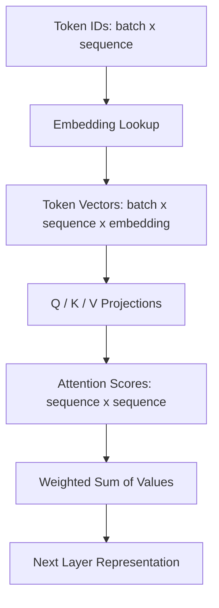

# Vectors, Matrices, Tensors, and Review

함수와 확률 출력, 벡터·텐서, loss와 최적화를 AI 모델의 계산 흐름으로 연결합니다.

---

## 06. Vector, Embedding, and Dot Product

### Learning Goal

대상을 벡터로 표현하는 이유를 이해하고, norm·dot product·cosine similarity가 검색과 attention에 어떻게 연결되는지 설명한다.

### Scalar와 Vector

| 개념 | 예시 | 의미 |
|---|---|---|
| Scalar | `35` | 숫자 하나 |
| Vector | `[65, 140, 90, 38.2]` | 순서가 있는 숫자 묶음 |

환자 feature vector의 각 위치는 나이, 혈압, 체온처럼 정의된 의미를 가진다. 벡터의 차원은 포함된 성분의 수다.

```text
patient vector = [age, systolic BP, diastolic BP, temperature]
                = [65, 140, 90, 38.2]
```

재입원 모델이라면 `[나이, 입원일수, 혈압, 혈당, 과거입원횟수]`처럼 feature vector를 만들 수 있다. 각 위치의 정의와 단위가 train과 inference에서 같아야 한다.

### Vector의 크기와 방향

벡터의 L2 norm은 원점에서의 길이다.

```text
||x||₂ = sqrt(x1² + x2² + ... + xn²)
```

정규화는 벡터를 길이 1로 만들어 방향 비교에 집중하게 한다. 반면 일부 모델에서는 벡터 크기 자체도 정보이므로 무조건 정규화하면 안 된다.

### Embedding

embedding은 단어, 문장, 이미지, 사용자 같은 대상을 학습된 고정 길이 벡터로 표현한다. 비슷한 맥락에서 사용되는 대상이 공간에서 가까워지도록 학습할 수 있다.

```text
"환불하고 싶어요" -> [0.12, -0.44, 0.87, ...]
"결제 취소 정책"  -> [0.10, -0.41, 0.82, ...]
```

가까움의 의미는 모델, 학습 데이터, similarity metric에 의존한다. embedding 거리가 인간의 모든 의미·사실·안전성을 보장하지는 않는다.

#### 의미 검색과 RAG 예시

사용자가 “돈을 돌려받고 싶어요”라고 질문했을 때 단순 키워드 검색은 표현이 다른 “결제 취소 정책” 문서를 놓칠 수 있다. 두 문장을 같은 embedding 모델로 벡터화하면 의미적으로 가까운 문서를 검색할 수 있다.

```text
user query -> query embedding
documents  -> document embeddings
similarity comparison -> top related documents
```

LLM, 추천, 검색, RAG에서 embedding을 쓰는 이유는 정확히 같은 문자열이 아니라 학습된 의미 공간의 가까움을 활용하기 위해서다.

### Dot Product

```text
a · b = a1*b1 + a2*b2 + ... + an*bn
```

기하학적으로 `a·b = ||a|| ||b|| cos(θ)`다. 방향이 비슷하고 크기가 클수록 내적이 커진다. 두 벡터의 차원이 같아야 한다.

간단한 계산 예시는 다음과 같다.

```text
a = [1, 2, 3]
b = [4, 0, -1]
a · b = 1*4 + 2*0 + 3*(-1) = 1
```

내적 결과는 벡터가 아니라 scalar 하나다.

### Cosine Similarity

```text
cosine(a,b) = (a·b) / (||a|| ||b||)
```

| 방법 | 반영하는 것 |
|---|---|
| Dot product | 방향과 크기 |
| Cosine similarity | 정규화된 방향 |
| Euclidean distance | 공간상 직선 거리 |

검색 시스템은 embedding 학습 방식과 인덱스 설정에 맞는 metric을 사용해야 한다.

### Attention의 내적

Transformer는 token 표현에서 Query, Key, Value를 만든다.

```text
score = QKᵀ / sqrt(d_k)
weights = softmax(score)
output = weights * V
```

Query와 Key의 내적으로 관련도를 계산하고, 차원 크기에 따른 score 증가를 `sqrt(d_k)`로 조절한다. softmax weight로 Value의 가중합을 만든다.

직관적으로 Query는 “지금 찾는 정보”, Key는 “각 token이 가진 검색용 표지”, Value는 “선택되었을 때 가져올 내용”이다. 문장의 “그것”이 앞의 어느 명사를 가리키는지 처리할 때 현재 token의 Query와 후보 token의 Key가 잘 맞는 위치에 높은 weight가 갈 수 있다.

### Technical Literacy Check

- 벡터의 차원과 norm을 구분할 수 있는가?
- dot product와 cosine similarity의 차이를 설명할 수 있는가?
- attention에서 Q, K, V가 각각 어떤 역할인지 직관적으로 말할 수 있는가?

### What I learned

벡터는 복잡한 대상을 계산 가능한 좌표로 표현한다. 내적은 두 표현의 정렬 정도를 측정하며, 검색에서는 유사도, attention에서는 정보 선택 weight의 출발점이 된다.

### Questions I can now ask

- embedding dimension과 학습 목적은 무엇인가?
- 검색에서 dot product, cosine, distance 중 무엇을 사용하는가?
- 저장된 벡터와 query 벡터가 같은 모델·정규화를 사용하는가?
- attention score를 왜 `sqrt(d_k)`로 나누는가?

---

## 07. Matrix, Tensor, and Shape

### Learning Goal

벡터를 batch로 처리하는 행렬곱과 다차원 데이터를 담는 tensor를 이해하고, shape·axis·broadcasting 오류를 읽는다.

### Matrix

행렬은 숫자의 2차원 배열이다.

```text
[[1, 2, 3],
 [4, 5, 6]]  -> shape [2, 3]
```

행은 샘플, 열은 feature로 사용할 수 있지만 문맥에 따라 의미가 다르다. shape 숫자만 보지 말고 각 axis가 무엇을 뜻하는지 기록해야 한다.

### Matrix Multiplication

```text
Input  [batch, input_dim]
Weight [input_dim, output_dim]
Output [batch, output_dim]
```

가운데 차원이 같아야 곱할 수 있다. `[32,128] × [128,64] = [32,64]`는 가능하지만 `[32,128] × [256,64]`는 불가능하다.

행렬곱은 원소별 곱과 다르다. `A @ B`와 `A * B`의 의미를 프레임워크 문법에서 확인해야 한다.

### Transpose

전치는 행과 열을 바꾼다. attention의 `QKᵀ`는 각 query와 각 key의 내적을 한 번에 계산한다.

```text
Q  [tokens, d]
Kᵀ [d, tokens]
QKᵀ [tokens, tokens]
```

결과의 각 원소는 한 query-token과 한 key-token의 score다.

### Tensor와 Axis

tensor는 다차원 배열의 일반적 이름이다.

| 데이터 | 대표 shape 예시 |
|---|---|
| 표 데이터 batch | `[batch, features]` |
| 이미지 | `[batch, channels, height, width]` |
| 문장 embedding | `[batch, sequence, embedding]` |
| multi-head attention | `[batch, heads, sequence, head_dim]` |

프레임워크마다 이미지 channel 위치가 다를 수 있다. 같은 숫자 shape라도 axis 의미가 다르면 잘못된 계산이 조용히 진행될 수 있다.

스칼라, 벡터, 행렬도 넓은 의미에서는 모두 tensor다.

| 표현 | 축 수 | 예시 |
|---|---:|---|
| scalar | 0 | `3` |
| vector | 1 | `[1,2,3]` |
| matrix | 2 | `[[1,2],[3,4]]` |
| higher-order tensor | 3 이상 | image batch, sentence batch |

### Reshape, Permute, Squeeze

- reshape/view: 원소 수를 유지하며 모양 변경
- transpose/permute: axis 순서 변경
- squeeze/unsqueeze: 크기 1인 axis 제거·추가
- concatenate/stack: tensor 결합

shape가 맞았다는 이유만으로 의미가 맞는 것은 아니다. batch와 sequence axis를 뒤바꾸면 계산은 실행되어도 결과가 틀릴 수 있다.

### Broadcasting

크기가 1인 axis를 확장한 것처럼 계산해 서로 다른 shape의 원소별 연산을 가능하게 한다.

```text
[batch, features] + [features] -> 각 row에 같은 bias 추가
```

편리하지만 의도하지 않은 broadcasting은 거대한 중간 tensor, 잘못된 결과, 메모리 부족을 만들 수 있다.

### Transformer의 Shape 흐름

문장 batch가 Transformer layer를 통과하는 단순화된 흐름은 다음과 같다.



Transformer는 문장의 token을 행렬·tensor 형태로 묶어 병렬 계산한다. multi-head attention에서는 embedding 차원을 여러 head로 나누어 `[batch, heads, sequence, head_dim]` 형태로 바꾼 뒤 다시 결합한다.

#### Shape mismatch 읽기

```text
[32, 128] @ [128, 64] -> [32, 64]  # 가능
[32, 128] @ [256, 64]               # 불가능
```

두 번째 계산은 안쪽 차원 `128`과 `256`이 다르다. 오류 메시지에서 tensor 이름, 예상 axis, 실제 shape을 차례로 확인하면 원인을 좁힐 수 있다.

### Technical Literacy Check

- 행렬곱에서 맞아야 하는 차원을 찾을 수 있는가?
- transpose와 reshape의 차이를 설명할 수 있는가?
- shape가 같아도 axis 의미가 틀릴 수 있음을 이해하는가?

### What I learned

행렬과 tensor는 많은 샘플과 token의 계산을 한꺼번에 표현한다. shape debugging은 숫자 배열의 크기뿐 아니라 각 axis의 의미와 변환 과정을 추적하는 일이다.

### Questions I can now ask

- 각 axis는 batch, sequence, channel, feature 중 무엇인가?
- 이 연산은 matrix multiplication인가 element-wise operation인가?
- reshape 후 원소와 axis 의미가 유지되는가?
- broadcasting이 의도된 동작이며 메모리 사용은 안전한가?

---

## 09. Summary and Math Literacy Checklist

### End-to-End Math Flow

```text
Input data
-> vector / tensor representation
-> matrix multiplication with weights + bias
-> nonlinear activation
-> logits and sigmoid / softmax output
-> loss calculation
-> gradient via backpropagation
-> parameter update by optimizer
-> repeat
```

### Core Concept Map

| 수학 개념 | AI에서의 역할 | 확인할 것 |
|---|---|---|
| Function | 입력을 출력으로 변환 | input/output, parameter |
| Weight & Bias | 선형·아핀 변환 | dimension, scale, interpretation |
| Activation | 비선형성 추가 | ReLU, GELU, sigmoid 등 |
| Exponential | 양수 비율과 score 차이 | overflow, softmax |
| Logarithm | 확률 곱을 합으로 변환 | log-probability, stability |
| Sigmoid/Softmax | logit을 제한된 출력으로 변환 | 문제 유형, calibration |
| Loss | 학습 목표 수치화 | 실제 오류 비용과 일치 여부 |
| Vector/Embedding | 대상을 숫자 공간에 표현 | dimension, norm, metric |
| Dot Product | 정렬·유사도 score | 크기 영향, QK attention |
| Matrix/Tensor | batch 다차원 계산 | shape와 axis 의미 |
| Derivative/Gradient | loss 변화 방향 계산 | vanishing/exploding |
| Backprop/Optimizer | gradient 계산과 update | learning rate, stability |

### Model Discussion Checklist

#### Representation

- 원본 데이터가 어떤 vector 또는 tensor로 변환되는가?
- 각 axis와 embedding dimension은 무엇인가?
- scaling, normalization, tokenization은 어디서 수행되는가?

#### Forward Pass

- 각 layer의 input/output shape은 무엇인가?
- linear transformation 뒤 어떤 activation이 적용되는가?
- output은 raw logit, probability, embedding 중 무엇인가?

#### Objective

- 어떤 loss를 사용하며 어떤 오류를 크게 벌주는가?
- class imbalance와 이상치는 어떻게 반영하는가?
- loss와 실제 제품·임상 평가 지표가 어떻게 연결되는가?

#### Optimization

- optimizer, learning rate, batch size는 무엇인가?
- gradient와 loss가 안정적인가?
- regularization과 early stopping은 validation data로 결정했는가?

#### Interpretation

- softmax가 높다는 이유만으로 현실 확률로 해석하지 않았는가?
- embedding similarity를 사실성이나 인과성으로 확대 해석하지 않았는가?
- feature weight나 importance를 원인으로 해석하지 않았는가?

### What to Learn Next

현재 트랙 이후 목적에 따라 확장한다.

- 선형대수 심화: span, basis, rank, eigenvalue, SVD, PCA
- 미적분 심화: Jacobian, Hessian, constrained optimization
- 확률 심화: random variable, expectation, distribution, Bayesian inference
- 수치해석: floating-point precision, conditioning, stable algorithms
- Transformer 심화: positional encoding, multi-head attention, normalization

고급 내용을 한꺼번에 암기하기보다 현재 모델에서 마주치는 계산과 연결해 학습하는 편이 효과적이다.

### 지금은 깊게 다루지 않아도 되는 수학

현재 목표가 비전공자의 AI 기술 문해력이라면 우선순위를 분명히 할 수 있다.

#### Eigenvalue와 Eigenvector

고유값과 고유벡터는 PCA, 행렬 분해, 동적 시스템과 일부 최적화 이론에 중요하다. 그러나 기본 모델의 forward pass, loss, gradient를 읽는 단계에서는 먼저 공부하지 않아도 된다.

#### 엄밀한 선형대수 증명

vector space, basis, linear independence, rank, eigendecomposition은 깊은 이해에 유용하다. 초기 단계에서는 증명보다 shape과 matrix multiplication이 실제 layer에서 어떻게 쓰이는지 먼저 익히는 편이 실용적이다.

#### Bayesian Mathematics

베이즈 정리는 조건부확률과 임상 결과 해석에 매우 중요하지만, 기초 계산 흐름보다 통계 트랙의 prevalence, PPV/NPV와 함께 학습하는 것이 자연스럽다.

“지금 미룬다”는 “필요 없다”는 뜻이 아니다. 현재 학습 목표에 맞춰 순서를 정한다는 뜻이다.

### Questions for an AI Model Meeting

#### 모델 구조

- 입력 feature는 어떤 vector 또는 tensor로 표현되는가?
- embedding dimension과 각 layer의 input/output shape은 무엇인가?
- binary sigmoid, exclusive softmax, multi-label sigmoid 중 어느 문제인가?

#### 학습

- loss function은 무엇이며 왜 이 오류를 크게 벌주는가?
- learning rate와 optimizer는 어떻게 정했는가?
- 학습이 불안정할 때 gradient norm, NaN, learning-rate curve를 확인했는가?

#### Transformer와 검색

- token은 어떤 embedding vector로 변환되는가?
- 검색 similarity는 dot product와 cosine 중 무엇인가?
- attention의 Query, Key, Value shape은 무엇인가?
- shape mismatch가 시작된 연산과 axis는 어디인가?

### Final Takeaway

AI 수학 문해력은 모든 공식을 손으로 유도하는 능력이 아니다. 데이터가 어떤 shape의 숫자로 바뀌고, weight와 activation을 거쳐 예측이 되며, loss와 gradient가 파라미터를 어떻게 바꾸는지 흐름을 추적하는 능력이다.

이 흐름을 이해하면 모델 설명의 `logit`, `embedding`, `attention`, `cross entropy`, `backpropagation`이 분리된 전문용어가 아니라 하나의 계산 과정으로 보이기 시작한다.

### What I learned

AI 모델의 내부는 표현, 변환, 목적함수, 미분, 업데이트가 반복되는 구조다. 수학 개념의 정의와 함께 값의 범위, tensor shape, 수치 안정성, 실제 평가와의 차이를 확인해야 기술적 설명을 정확히 이해할 수 있다.

---

[이전: Loss and Optimization](./02-loss-and-optimization.md) · [트랙 목차](./README.md)
