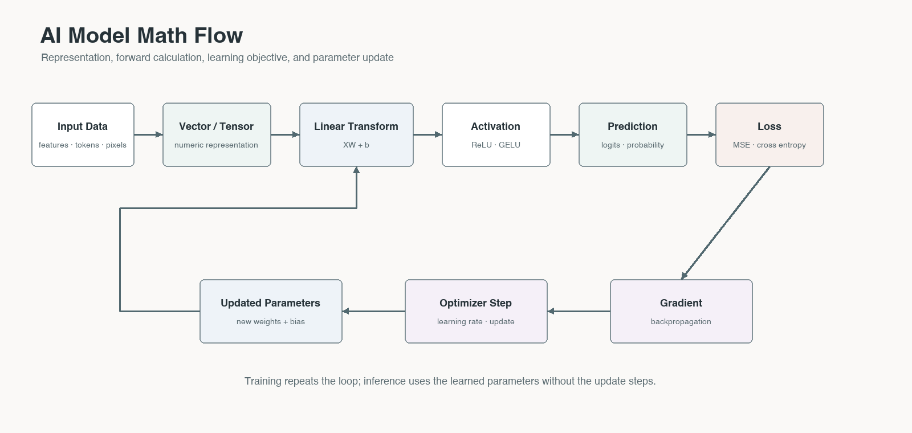

# Math for AI Literacy

함수와 확률 출력, 벡터·텐서, loss와 최적화를 AI 모델의 계산 흐름으로 연결합니다.

## Contents

1. [Functions, Scores, and Probabilities](./01-functions-scores-and-probabilities.md)
   - 01. Functions and Models · 02. Linear Equations, Weight, and Bias · 03. Exponential and Logarithm · 04. Sigmoid and Softmax
2. [Loss and Optimization](./02-loss-and-optimization.md)
   - 05. Loss Functions and Cross Entropy · 08. Derivative and Gradient Descent
3. [Vectors, Matrices, Tensors, and Review](./03-vectors-matrices-tensors-and-review.md)
   - 06. Vector, Embedding, and Dot Product · 07. Matrix, Tensor, and Shape · 09. Summary and Math Literacy Checklist

## Reading Guide

각 통합 문서는 서로 연관된 기존 장을 한 학습 단위로 묶었습니다. 문서 내부의 구분선과 장 제목을 이용하면 기존 세부 주제를 그대로 찾아볼 수 있습니다.

[전체 프로젝트로 돌아가기](../../README.md) · [References](../../references/math-for-ai.md)
